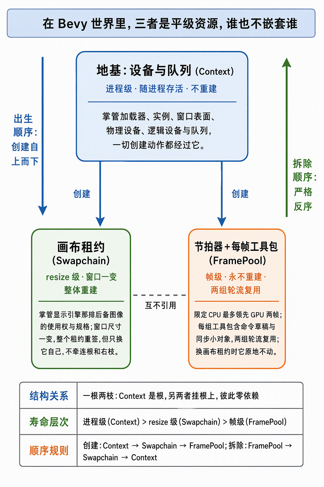
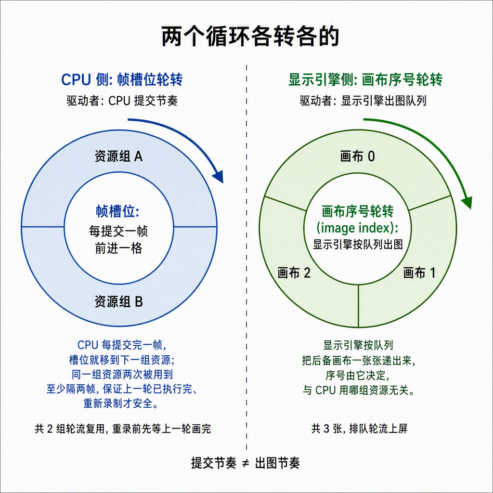

# Context、Swapchain、FramePool三者关系：资源平级，对象分层

> 2026-09-22，关系总览篇。回答一个看代码时必然冒出的问题：**这三个 Resource 是平行关系吗？** 配套阅读：《Context与Swapchain分家：按生命周期拆分.md》（讲"为什么拆"，本文讲"拆完长什么样"）、《VulkanContext字段释义：从Entry到Swapchain.md》§12（生命周期四层表的出处）、《[帧流程：一帧之内各Vulkan对象如何接力.md](帧流程：一帧之内各Vulkan对象如何接力.md)》（讲"一帧内怎么协作"，本文 §2 视图二只给归属，接力细节以它为准）。

## 0. 一句话结论

**"平行"只说对了一半，取决于你站在哪一层看：**

- **Bevy World 里——平行。** 三者都是 `Resource`，平铺存放，谁也不嵌套谁；
- **Vulkan 对象图里——不平行，是一根两枝。** `Context` 是根，一切创建必经；`Swapchain` 与 `FramePool` 是两条互不引用的枝，彼此之间才真正平级；
- **时间轴上——不平行，是三层楼。** 进程级 ⊃ resize级 ⊃ 帧级：出生顺序 Context → Swapchain → FramePool，死亡严格反序。

一句话收束：**资源平级，对象分层，寿命三层。**

## 1. 各自代表什么

| | 一句话 | 持有（全部字段） | 寿命与重建 | Drop 销毁序 |
|---|---|---|---|---|
| `vulkan::Context` | **地基**：我在哪块 GPU 上、哪个实例、窗口在哪 | Entry / Instance / surface_fns / **Surface** / messenger / PhysicalDevice / Device / queue_family_index / Queue | 进程级；**不重建** | wait_idle → Surface → Messenger → Device → Instance（vulkan.rs:248） |
| `swapchain::Swapchain` | **画布租约**：present engine 那排 backbuffer 的使用权与规格 | fns / Device(clone) / swapchain / images / views / format / extent | resize 级；`rebuild()` 整体重签（swapchain.rs:146） | views → swapchain，幂等 |
| `frames::FramePool` | **节拍器 + 每帧工具包**：CPU 领先 GPU 的闸门与轮转资源 | Device(clone) / command_pool / 2×Frame（命令缓冲+双信号量+fence）/ current 游标 | 帧级；**不重建，跨重建轮转复用**（frames.rs:22） | 同步对象逐个 → 命令池 |

逐个展开（Unity/D3D 类比随行）：

- **Context = 地基。** 回答"在这台机器上，Vulkan 世界长什么样"：loader、实例、窗口 surface、物理设备、逻辑设备、队列。全项目**任何** Vulkan 动作都从这里出发。类比 Unity 的 `GfxDevice` / D3D 的 `ID3D11Device + IDXGIFactory` 绑 HWND 的持久集合。注意它捎带 Surface（窗口级）——单窗宿主壳的暂时并入，多窗时要升格独立（分家文档 §6）。
- **Swapchain = 画布租约。** 它不是"一块显存"，是 present engine 手里那排 backbuffer 的**使用权**：格式（BGRA8_UNORM 优先）、尺寸（`caps.current_extent`，驱动说了算）、几张图（min+1=3，MAILBOX 语义所需）。窗口一变，整个租约重签——类比 `IDXGISwapChain`，`rebuild` ≈ `ResizeBuffers`（D3D 隐式处理，Vulkan 手动先拆后建）。
- **FramePool = 节拍器 + 工具包。** 节拍器：`MAX_FRAMES_IN_FLIGHT = 2`，CPU 提交最多领先 GPU 两帧，第 N 帧要等第 N−2 帧的槽位空出来；工具包：每帧一组"命令缓冲 + 进场信号量 + 出场信号量 + 重录闸门 fence"。类比 D3D12 的 frame resources（frame fence + command allocator 每帧轮转）。

## 2. 一张图：一根两枝三层次



*图为结构总览：蓝 = 根（进程级），绿 = 画布租约（resize 级），橙 = 节拍器+每帧工具包（帧级）；两枝间断线即"互不引用"，两侧长箭头是出生/拆除方向。精确字段与 file:line 锚点以下方三个视图的文本为准。*

**视图一：创建期依赖（Startup，一次，host.rs:102 try_init_vulkan）**

```
Entry → Instance → messenger
      → Surface（手写 Win32）
      → PhysicalDevice → Device → Queue
      └──────── 全部收进 vulkan::Context（根）────────┘

Context::new(wrapper)
   ├─→ Swapchain::new(&ctx)      枝一（resize 级）
   └─→ FramePool::new(&ctx)      枝二（帧级）

枝一 ⇄ 枝二：字段零引用。各自只 clone 一份 Device 句柄供自己 Drop；
全部往来走 draw_frame 的函数参数，不走对象字段。
```

**视图二：一帧内的分工（运行期，每帧，host.rs:117）**

```
draw_frame 一步一环（host.rs draw_frame）：
  wait_and_reset   FramePool 出面 —— in_flight fence 等 GPU 追平，重置命令缓冲
  rebuild          Swapchain 出面 —— 重查 caps、先拆旧后建新（借 ctx 的 PD/Surface/Device）
  acquire          Swapchain 出面 —— 递出一张可画 image + index；信号量是 FramePool 的
  record+submit    FramePool 出面 —— 把递来的 image/view 录成清屏，经 ctx.queue 提交
  present          Swapchain 出面 —— 图交还 present engine；render_finished 是 FramePool 的
  advance          FramePool 收尾 —— 帧槽位轮转 MOD 2
```

五步接力的逐对象细节（谁等谁的信号量、fence 何时置位、三帧时间线看两帧在飞）见《帧流程》原理篇——本表只回答"每步谁出面"。

**视图三：寿命时间轴（拆除反序，host.rs:203 teardown_vulkan）**

```
Context    ████████████████████████████████████  进程活它活，不重建
Swapchain  ███████▒▒▒▒▒▒▒▒▒▒███████████          ▒ = rebuild 整体换血
FramePool  ██████████████████████████████████    从不重建，槽位轮转
           ↑出生顺序自上而下；死亡顺序自下而上（帧级→resize级→进程级）
```

## 3. 三问三答："平行"到底怎么说

| 视角 | 平行吗 | 关系实质 |
|---|---|---|
| **ECS 存储**（Bevy World） | ✅ 平行 | 三个并列 Resource；insert 顺序 = 创建顺序（host.rs:93），但 World 清场对 Resource 顺序任意——这正是退出必须手动反序 `remove_resource` 的原因 |
| **对象图**（谁离不开谁） | ❌ 一根两枝 | Context 是根：两个枝的创建链都必经它；Swapchain 与 FramePool 之间零依赖——**swapchain 整体重建时 FramePool 一根毫毛不动**（分家文档 §2 的判定线） |
| **时间轴**（寿命） | ❌ 三层楼 | 进程级 > resize级 > 帧级；出生正序、死亡反序，拆错序 = `IN_USE` / use-after-destroy 类崩溃 |

补充一个易漏的细节：Swapchain 和 FramePool 各自 `clone` 了一份 `ctx.device`（ash 的 `Device` 是可 clone 的函数表句柄）——这不是"嵌套了 Context 的一部分"，是**对根的单向引用**，仅用于自己 Drop 时销毁挂在 Device 上的对象。依赖方向仍然严格：枝 → 根，永不反向。

## 4. 最容易混的一点：两个独立循环

`draw_frame` 里有**两个轮转**，各自转各自的，绝不互相推导：



*图为两个循环的运转方式：左环 = CPU 每提交一帧前进一格（资源组 A/B），右环 = 显示引擎按队列出图（画布 0/1/2）；两环之间没有任何依赖箭头，"互不推导"就是重点。*

| | 轮转主体 | 周期 | 驱动者 |
|---|---|---|---|
| 帧槽位游标 `frames.current` | FramePool 的 2 组资源 | MOD 2 | CPU 提交节奏（`advance`） |
| image index（acquire 返回值） | Swapchain 的 N 张图 | MOD N（3 张） | present engine 的出图节奏 |

两枝每帧仍要**握手两次**：acquire 用 FramePool 的 `image_available`，present 用它的 `render_finished`——但注意 API 形状：`Swapchain::acquire(&self, semaphore: vk::Semaphore)` 信号量是**参数传入**，不是字段持有。分家解耦的是**所有权**，不解除**协作**；每帧握手走函数参数，正是"重建时同步对象原地不动"在代码形状上的保证。原理详解见分家文档 §4。

## 5. Unity / D3D 对照（关系视角）

| 关系问题 | 本项目 | D3D / Unity 对应 |
|---|---|---|
| 根是谁、一切资源从哪出发 | `Context`（进程级） | `ID3D11Device` + `IDXGIFactory` ≈ Unity `GfxDevice` |
| 画布挂在哪、跟帧同步有无关系 | `Swapchain` 挂 Surface，与帧资源无关 | `IDXGISwapChain` 挂 device，与 frame fence 互不相干 |
| 帧资源怎么轮转、几个索引 | FramePool 槽位 MOD 2 × image index MOD 3 | D3D12 官方化两索引：`FrameIndex` vs `BackBufferIndex` |
| "过时"归谁管 | `SwapchainOutOfDate` 由 Swapchain 报、host.rs 编排重建 | D3D `ResizeBuffers` 隐式处理，无对应错误码 |

同一根两枝的形状在 D3D/Unity 里也存在，只是被引擎藏起来了：Vulkan 的教学价值恰恰是亲手把这三层摆上桌面。

## 6. 收束

为什么这个形状是"对的"？分家文档 §1 给过三笔账（重建动作合法化、Drop 责任代码化、错误语义可 match），本文换一个角度收束：**名字即寿命，寿命即结构**——看到 `Context` 知道它跟进程同寿，看到 `Swapchain` 就该预期一个 `rebuild`，看到 `FramePool` 就该预期轮转。步骤 3 的管线/描述符/bindless 池将长在 FramePool 的录制段里，同步骨架不动（分家文档 §6）。
