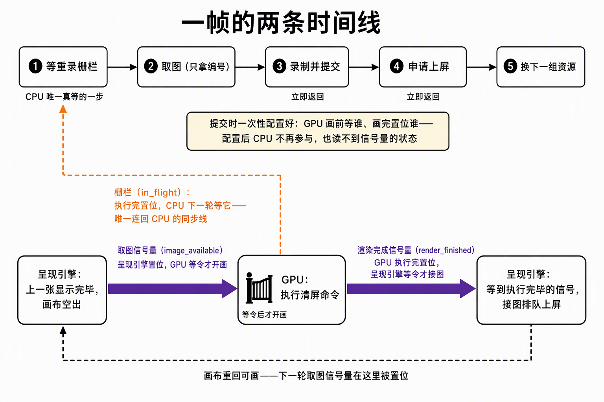
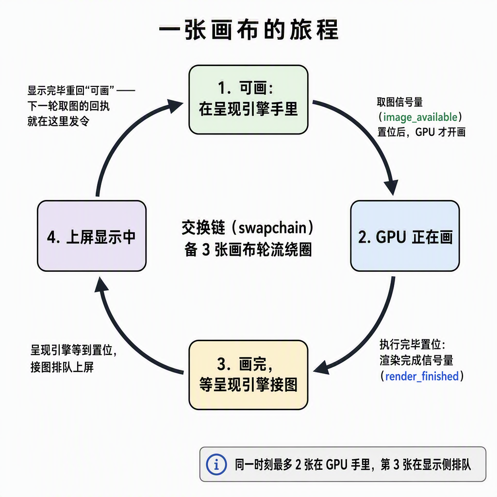

# 帧流程：CPU 与 GPU 的两条时间线

> 2026-09-22 定稿（同日两轮重写：初版抽象看不懂，二版图误导"信号量状态传回 CPU"）。配套：分家篇（对象怎么拆）、2-宿主壳搭建记录 §4。代码锚点：`ash_renderer/src/host.rs` 的 `draw_frame`（2026-09-22 步骤 3 开工结构整理自 main.rs 迁入，函数名与编排不变）。

## 0. 一句话结论

一帧五个调用，CPU 只在第 1 步真等过一次（等的是栅栏），acquire / submit / present 全是异步投递、立即返回。**CPU 对信号量只做"配置"**：submit / present 调用的瞬间登记好"GPU 执行到哪一步前等谁、执行完置位谁"，排完班就走——**此后不参与、不读取、也无法感知信号量的状态**。信号量不是标志位，是 GPU 时间线上"谁先谁后"的一段排序。唯一能被 CPU 等待的是栅栏。

## 1. 两条时间线

```
CPU ：等栅栏 → 取图 → 录命令 → submit(立即返回) → present(立即返回) → advance
                                │投递完马上返回，GPU 还没开始跑
GPU ：                        └──────── 执行清屏命令缓冲 ────────┘ → 执行完
```

| 调用 | CPU 侧发生什么 | CPU 等吗 |
|---|---|---|
| `wait_and_reset` | 等本槽位栅栏，过闸后重置栅栏与命令缓冲 | **等**（全帧唯一一次） |
| `acquire(sem)` | 要图的编号，递上信号量登记发令方 | 不等，拿 index 就走 |
| `record_clear_and_submit` | 录命令 → `queue_submit` 投递 | 不等 |
| `present(sem, index)` | 递交"第 index 张图上屏"申请 | 不等 |
| `advance` | 槽位游标 +1（MOD 2） | — |

submit 若等执行完才返回，CPU 就得陪跑 GPU，两帧在飞无从谈起——异步投递是前提，三个同步对象负责把顺序钉回来。



*紫边 = 信号量，全程在下方流转；橙色折线 = 栅栏，唯一连回 CPU 的同步线。*

## 2. 三个同步对象：谁置位、谁等令

| 对象 | 置位方 | 等令方 | 守哪段 |
|---|---|---|---|
| `image_available`（信号量） | 驱动呈现引擎（图真正空出时） | GPU：写颜色阶段前 | 可画 → 开画 |
| `render_finished`（信号量） | GPU（提交执行完） | 呈现引擎：接图前 | 画完 → 上屏 |
| `in_flight`（栅栏） | GPU（提交执行完） | **CPU**：下轮重录前 | 执行完 → 可重录 |

置位与等待的**执行者没有一个是 CPU**（栅栏的等令方除外）。判定线：信号量管 GPU 内部交接、CPU 摸不到它的值；栅栏是唯一回到 CPU 的那根。（等待为什么精确到"写颜色"阶段、屏障与信号量如何分工接力——深一层机制见《[PipelineStage：屏障与信号量的共同语言.md](PipelineStage：屏障与信号量的共同语言.md)》。）

### image_available：发令方在驱动里

- `acquire(sem)` 的信号量是**输出参数**：登记"图空出来时由呈现引擎置位"——置位语句不在你的代码里，这就是"没有代码激活"的原因；CPU 换回的 index 只是编号，"能写了"的许可送达的是 GPU 的提交，不是 CPU；
- `submit.wait_semaphores`：等在 GPU 侧，钉在 `COLOR_ATTACHMENT_OUTPUT`（真要往图上写颜色的阶段，之前的顶点处理可与等图重叠）；
- 给 acquire 传 fence 也能跑（CPU 阻塞等图），但 CPU 会卡死在取图——选信号量，等待下沉到 GPU 时间线。

### render_finished：submit 返回 ≠ 执行完

- CPU 调 present 时 GPU 还在画；提交批次全部执行完，GPU 才置位它；
- present 把它登记为"接图前等待"后立即返回，等令的执行者是驱动的呈现引擎——不接半成品。

### in_flight：CPU 的重录闸门

- 提交执行完置位，CPU 下轮重录同组命令缓冲前等它——重录安全的全部含义；
- 管重录安全，不管节流（节流在 FIFO 显示队列）；初值 `SIGNALED`，第 1 帧立即过闸。

## 3. 一张图的旅程



可画 →（图空时置位 `image_available`）→ GPU 画 →（执行完置位 `render_finished`）→ 呈现引擎接图、FIFO 排队上屏 → 显示完毕 → 重新可画。**`image_available` 的置位是"上一轮显示结束"干的事**，acquire 只是登记了发令方。整圈没有一步需要 CPU 在场。

## 4. 两帧在飞

帧槽位（MOD 2）与 image index（MOD 3）是两个独立循环。**在飞 = 已 submit、GPU 未执行完**：

| 帧 | CPU | GPU 同时在跑 |
|---|---|---|
| 1 | 等 A（初值 SIGNALED 立即过）→ 提交 → advance 到 B | 执行第 1 帧 |
| 2 | 等 B（立即过）→ 提交 → advance 到 A | 还在执行第 1 帧 |
| 3 | 等 A——**撞闸**，第 1 帧执行完才能重录 A 组 | 执行第 2 帧 |

闸门是安全带不是油门：常规节流在 acquire（FIFO 显示队列满）。信号量一次一发一收，每次 acquire 都要干净的信号量——同槽位两次至少隔 2 帧，这就是按槽位备两套的前提。

## 5. OUT_OF_DATE：控制流不是失败

acquire 阶段报 → 立即重建、本帧跳过；present 阶段报 → 图已交出，标记下轮重建；SUBOPTIMAL → 画完这帧再重建。`rebuild` 里的 `device_wait_idle` 是 CPU 唯一一次全量等 GPU（在飞帧还引用旧 image，拆早了是未定义行为）。

## 6. Unity / D3D 映射

| 本项目 | D3D 对应 | 差异要点 |
|---|---|---|
| acquire + `image_available` | `GetCurrentBackBufferIndex` | D3D 把"取编号 + 等可写"打包进交换链 |
| `render_finished` + present 等令 | DXGI `Present` 内部同步 | D3D 替你等，看不见这根线 |
| `in_flight` fence | D3D12 帧 fence | FrameIndex vs BackBufferIndex，Vulkan 自己组合 |
| 在飞数 = 2 | 三重缓冲 CPU 领先上限 | 与 image 数解耦的常数 |

## 7. 步骤 3 生长点

同步骨架不动，管线 / 顶点 / 描述符都往录制段长；引入 transfer 队列时三段接力按队列重新分家，判定线不变。
