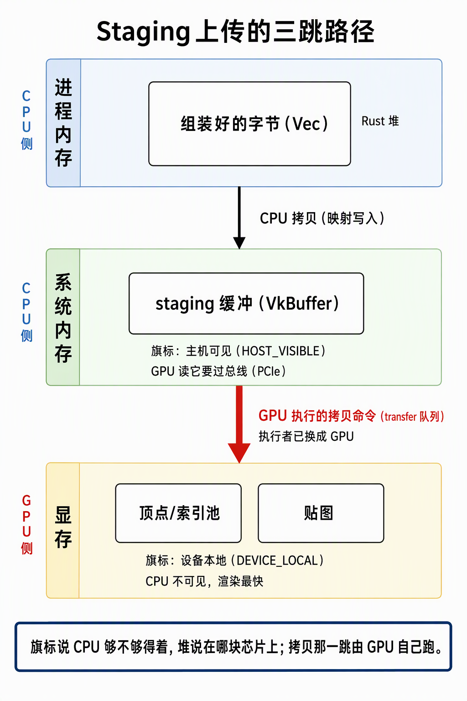

# Buffer与Staging上传：三跳路径与内存堆拓扑

> 2026-09-29,3.4 收官后的上传机制补课篇（本批三篇之一，另两篇：《[Uploader：搬运收口、完成票据与frenderers对照](Uploader：搬运收口、完成票据与frenderers对照.md)》《[Barrier家族：处置载荷、三种屏障与常见形状](../3.4-管线与绘制/Barrier家族：处置载荷、三种屏障与常见形状.md)》）。回答三个连环问题：staging 到底是什么、HOST_VISIBLE 内存在哪块芯片上、为什么上传必须是两跳。证据：本机 vulkaninfo 实测（Vulkan 1.4.357）+ `ash_renderer/src/vulkan/resources.rs`（BufferRole→MemoryContract 选型）、`vulkan/uploader.rs`（staging 环）。同类参考：[GpuBuffer：契约、用法与frenderer三分法对照](GpuBuffer：契约、用法与frenderer三分法对照.md)。

## 0. 判定线

- **staging 本身是 VkBuffer**（正经的 Vulkan 对象，有自己的设备内存分配），不是"Rust 内存"；只是它选的内存类型带 **HOST_VISIBLE**——CPU 把这段内存映射进自己的虚拟地址空间，拿到指针直接 memcpy。所以写进 staging 的那一步是"从 Rust 堆到 Vulkan 的 CPU 可见内存"，这个说法成立；但**拷进显存的最后一步，执行者已经换成 GPU**。
- **上传是三跳，不是两跳**：Rust 堆 →（CPU memcpy）→ staging（HOST_VISIBLE，物理在系统内存）→（GPU 执行的拷贝命令）→ 池/贴图（DEVICE_LOCAL，物理在显存）。
- **HOST_VISIBLE 管"CPU 够不够得着"，DEVICE_LOCAL 管"GPU 是否近距离"——两个旗标正交**；内存到底在哪块芯片上，由它落在哪个**内存堆（heap）**决定，不由旗标决定。
- staging 的第二个价值：**把 CPU 与 GPU 的时钟解耦**——staging 环两槽轮转，GPU 在拷第 N 批时 CPU 可以在写第 N+1 批。

## 1. 为什么是三跳：两种内存的优点不可兼得

独显的物理事实：显存（VRAM）GPU 访问最快，但**不在 CPU 的地址空间里**，CPU 写不到；系统内存 CPU 原生可写，但 GPU 读它要过 PCIe，慢一个量级，拿来做渲染数据不合适。两个"最快"不落在同一块芯片上，就必然有一趟"各取最优 + 中间衔接"：

- CPU 对系统内存写（CPU 的强项）；
- GPU 从系统内存读一次、写进显存（GPU 的强项，transfer 队列专职干这个）；
- 从此渲染只碰显存。

**staging 就是那块"两边都够得着"的中转地**——它的访问模式是"CPU 写一次、GPU 读一次"，对渲染性能没有要求，所以住在慢的、CPU 可见的一侧完全合理。

*读图：三跳的执行者换人——第一跳 CPU 对映射内存 memcpy，第二跳（红色）是 GPU 跑的拷贝命令；staging 与显存分属两个堆，旗标只是能力声明、堆才是物理位置。*

## 2. 本机内存堆实测

`vulkaninfo` 实测（2026-09-29），三个堆决定了一切落位：

| 堆 | 大小 | 旗标 | 物理位置 | 谁住这里 |
|---|---|---|---|---|
| heap[0] | 5.81 GiB | DEVICE_LOCAL | **显存**（卡上，CPU 不可见） | 顶点/索引池、GpuImage、深度附件 |
| heap[1] | 31.95 GiB | 无 | **系统内存**（主板 DRAM） | **staging** |
| heap[2] | 214 MiB | DEVICE_LOCAL | **BAR 窗口**（显存里划给 CPU 直写的一小块） | 本项目不用 |

内存类型层面：staging 命中 type[3]/type[4]（HOST_VISIBLE+HOST_COHERENT，后者多一个 HOST_CACHED——CPU 侧可缓存，写更快）；池与图像命中 type[1]/type[2]（纯 DEVICE_LOCAL）。`MemoryContract` 按 `BufferRole` 找满足要求旗标的类型（resources.rs），选型证据落日志（深度附件日志"内存类型 N（DEVICE_LOCAL）"同款，frames.rs:193）。

## 3. 三种拓扑：要不要 staging 由拓扑决定

| 拓扑 | 内存布局 | 上传路径 |
|---|---|---|
| 独显（本机） | 显存与系统内存分开 | 两跳：CPU 写系统内存 → GPU 拷进显存 |
| BAR 窗口（本机也有，heap[2]） | DEVICE_LOCAL + HOST_VISIBLE | CPU **可直写显存**——但窗口仅 214 MiB、PCIe 写带宽有限，适合小数据/驱动内部，不当 14.7 MB 一批贴图的主力路线 |
| 核显 / iGPU | 统一内存：同一块 DRAM 既 DEVICE_LOCAL 又 HOST_VISIBLE | 理论零拷贝——CPU 写完即 GPU 可用 |

本机的 BAR 窗口正是"能不能省掉一跳"的活证据：能，但对批量数据反而更慢——经典两跳仍是主流。

## 4. 环形复用与时钟解耦

staging 按两槽轮转（`Uploader` 的 `slots`）：GPU 在飞拷贝第 N 批时，CPU 已在写第 N+1 批的 staging——**上传与帧循环同呼吸，谁也不等谁**。安全链只有一条：槽位复用前查该槽上一轮票据，未完成则 CPU 等待（全流程唯一 CPU 等待点，见 Uploader 篇 §2 第 1 步）。

一个防御性细节：staging 类型若不带 HOST_COHERENT，CPU 写完必须手动 `vkFlushMappedMemoryRanges` 才对 GPU 可见——`GpuBuffer::write` 内建了这个 flush（uploader.rs:293-294 模块注释）。本机命中的类型都是 coherent，flush 实际是 no-op，但机制保留——**不依赖"本机恰好是"**。

## 5. 对照：Unity / D3D12 / frenderer

| 本项目 | 对应物 | 差异 |
|---|---|---|
| staging + `cmdCopyBuffer` | D3D11 `UpdateSubresource` / D3D12 UploadHeap + CopyQueue | 引擎和运行时把三跳打包成一个调用 |
| staging 环两槽 | 流送上传池 | 同形状；槽位数是显式参数（我们=2） |
| `MemoryContract` 按角色选型 | D3D12 Heap 类型 / Unity `Persistence` 标志 | 同一件事：用途定内存类型 |
| frenderer 的 `RenderBuffer`（用完即弃、逐次等待） | —— | 形状同款但无环、无票据，见 Uploader 篇 §5 |

**自测三问**（能答出才算过）：
1. 三跳里哪一跳的执行者是 GPU？src/dst 各是什么 Vulkan 对象？
2. 本机 staging 落在哪个堆？BAR 窗口为什么不当贴图主力路线？
3. staging 类型若不是 HOST_COHERENT，CPU 写完还差哪一步才对 GPU 可见？
