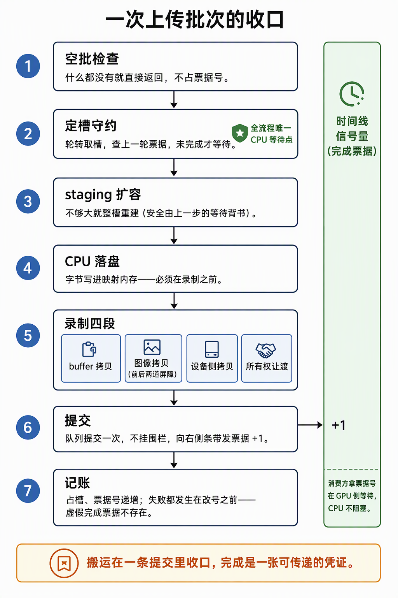

# Uploader：搬运收口、完成票据与frenderers对照

> 2026-09-29,3.4 收官后的上传机制补课篇（本批三篇之二）。回答：`Uploader` 的定位与状态、`submit_batch` 七步流程、能力边界、以及卖点——卖点全部对着 frenderer 的底牌打（同是你写的 Vulkan 渲染器，同步策略取了"最简"档）。代码锚点：`ash_renderer/src/vulkan/uploader.rs`（本文主战场）、`ash_renderer/src/upload.rs`（`flush_uploads` 组批）；frenderers：`modules/render/vulkan/src/command_manager.rs:42-115`、`render_texture/rt_util.rs`。内存拓扑见《[Buffer与Staging上传：三跳路径与内存堆拓扑](Buffer与Staging上传：三跳路径与内存堆拓扑.md)》。

## 0. 判定线

- **`Uploader` 是传输层**：它持有的状态（staging 环、票据账本）全部服务于"搬运的时序安全"，对"搬运的内容"**零状态**——`UploadBatch` 是纯数据（字节 + 目的地句柄），内容决策在 `upload.rs`，驻留账本在 `MeshPool`/`ImageCache`。账与货分家，它才能作为 `Resource` 被任何系统借用。
- **一次合批 = 一个 staging 范围 + 一次 transfer 提交 + 一张票据**：提交次数从 O(资产) 收口到 O(1)（每帧一批，mesh 6 + 贴图 15 同批）。
- **完成语义单轨制**：提交挂 **null fence**，完成只由 timeline 票据表达——同一张票，CPU 可查（`get_semaphore_counter_value`）、GPU 可等（帧提交 wait @ALL_COMMANDS）、可当槽位复用判据、可传递给消费方。
- **失败结构化**：空批不提交不占号；`next_ticket += 1` 在全部 `?` 早退点之后——**虚假完成票据在结构上不存在**。

## 1. 三方分工：组货、搬运、记账

| 角色 | 文件 | 职责 | 不碰什么 |
|---|---|---|---|
| 组货 | `upload.rs`（`flush_uploads`，Last 系统） | 快照去重 → 转换 → 组 `UploadBatch` | 不碰队列、不知 GPU 何时完成 |
| 搬运 | `vulkan/uploader.rs`（`Uploader`） | staging 环 + transfer 提交 + 发票据 | 不拥有任何资产，不记驻留账 |
| 记账 | `MeshPool` / `ImageCache` | 槽位/驻留账本，发布槽位号 | 不碰队列提交 |

## 2. `submit_batch` 七步流程（每步守一条契约）

*读图：右侧条带是完成票据（timeline）——第 6 步向它 +1，消费方在 GPU 侧按值等待、CPU 不阻塞；"全流程唯一 CPU 等待点"徽章挂在第 2 步（槽位复用）。*

1. **空批守门**（uploader.rs:300-307）：四类段全空 → `Ok(None)`，不提交不占号——不留一张永不兑现的票（票据 0 专表空批，永不 signal）。
2. **定槽守约**（:308-317）：游标取槽 → 查该槽上一轮在飞票据 → timeline 计数不够则 CPU 等（**全流程唯一 CPU 等待点**，只在复用路径，必落日志）。等完才换来两份安全：重置命令缓冲安全、覆写 staging 安全。
3. **staging 按需扩容**（:319-335）：不够大整槽重建——不踩在飞读，由第 2 步背书。
4. **CPU 落盘**（:342-345）：本批字节 memcpy 进映射 staging（非 coherent 自动 flush）。必须在录制前——拷贝的源就是它。
5. **录制四段**（:346-519）：
   | 段 | 内容 | 屏障语义 |
   |---|---|---|
   | buffer 段 | staging→池逐段拷贝 | 段内零屏障——消费者在另一条队列另一份提交，跨队列可见性归票据 |
   | 图像段 | 每图：免单进场（UNDEFINED→TRANSFER_DST）→ `copyBufferToImage` → 全单出场（→SHADER_READ_ONLY，srcAccess 冲缓存） | 进场免单、出场全单；带 release 时所有权让渡合成进同一条屏障 |
   | 设备侧段 | 池→池迁移拷贝 | 逐池"写后读"屏障（TRANSFER_WRITE→TRANSFER_READ） |
   | release 段 | buffer 所有权让渡（EXCLUSIVE 形状） | 3.4 CONCURRENT 后生产路径为空，形状保留 |
6. **提交发票据**（:520-536）：`queue_submit`（transfer 队列），fence null，signal 票据新值（挂 `TimelineSemaphoreSubmitInfo`，VUID-03239/03241）。
7. **记账**（:537-541）：占槽 `in_flight=ticket`、`next_ticket += 1`。

## 3. 能力边界：刻意冻结的闭集

**能**：staging→池 buffer 拷贝、staging→2D mip0 单层图像拷贝、池→池设备侧拷贝、EXCLUSIVE buffer release 形状。**不能**：mipmap 生成（无 blit）、3D/cube/array 层、图像→图像拷贝、clear 命令、回读、多队列调度（绑定单一 transfer 队列）。

两条配套纪律：目的地资源它一个都不创建（只要求自带 `TRANSFER_DST` usage，创建归 `MeshPool`/`images.rs`）；对齐纪律归调用方（texel block 4B 倍数等）。要 mip 链/回读就是**扩图像段**，不是重构——M2 冻结最小闭集是刻意的（"明确处理，不静默"）。有趣对照：frenderers 反而有 `generate_mipmaps` 和 image→image blit（rt_util.rs:103/140）——它功能更宽、同步更糙（§5），两边的取舍各自自洽。

## 4. 卖点五张牌（对照 frenderer）

| 卖点 | 内容 | frenderer 对照 |
|---|---|---|
| 一次提交收口一批 | mesh 6 + 贴图 15 = 一次提交一张票；驱动开销摊平 | 一张贴图两次提交（`change_state` + `copied_from_buffer` 各一次，rt_util.rs:29/41） |
| 完成凭证可传递 | 票据 CPU 可查、GPU 可等、可复用判据、可转交消费方 | 每次调用新建 fence → 等死 → **销毁**（command_manager.rs:97-115）——完成即湮灭，无凭证可交 |
| CPU 等待只关税 | 逐批路径零 idle；等待只在槽位复用且必落日志（"不冒充零 idle"） | 每次上传 `wait_for_fences(u64::MAX)`，CPU 与搬运完全串行 |
| 失败结构化 | 空批不占号；改号在早退点之后 | one-shot 路径失败=半途 fence 丢弃，无"承诺账"可对 |
| 账货分家 | 传输层不拥有资产，内容与驻留各归其主 | 每张贴图自管 `image_state`（rt_util.rs:12-27），状态与搬运耦在资产上 |

## 5. frenderer 为什么"不需要"这套

翻源码的结论：**frenderers 里有等价物——`execute_single_time_command`（command_manager.rs:42），只是它把同步简化成"每次 CPU 等死"**：临时命令缓冲 → `queue_submit`（新建 fence）→ `wait_for_fences(u64::MAX)` → 销毁 fence → 释放缓冲。三个结构性事实让它不需要我们的那套：

1. **单队列**：命令池与提交都回 graphics 队列（command_manager.rs:19/112）——没有跨队列交接，"完成凭证"要解决的问题不存在；
2. **同步契约**：调用处往下走时数据保证就绪，"什么时候可采样"无需记账；
3. **规模豁免**：上传在启动期、不在帧热路径，逐次等待的代价可忽略。

所以不是 frenderer 少写了东西，是它的契约（单队列 + 同步上传 + 启动期加载）把那层复杂度整体消掉了。ash_renderer 把上传放进 `Last` 系统、与帧循环同呼吸，"逐次等死"立刻变成毒药——staging 环、票据、GPU 侧等待才成为必需。**这层从"藏在两行调用里"到"亲手拍的板"，正是 3.2/3.3 的学习目标。**

**自测三问**（能答出才算过）：
1. `Uploader` 持有哪些状态？为什么说它对"内容"零状态？
2. 全流程的 CPU 等待点在哪？它为什么合法且必要？
3. 提交挂 null fence 后，"GPU 完成"由谁证明？CPU 和 GPU 各怎么用它？
