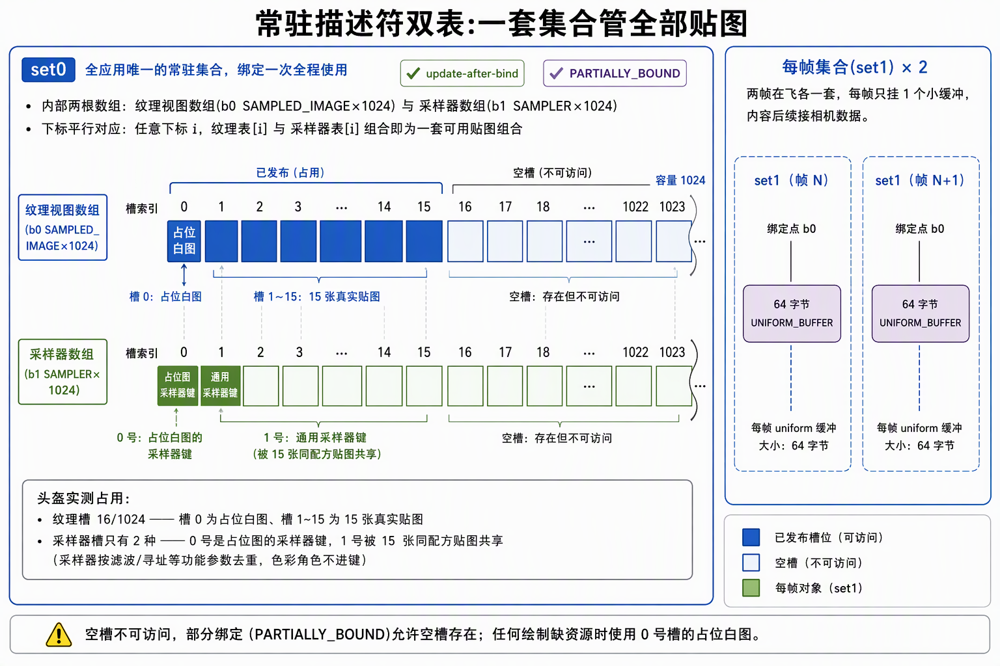
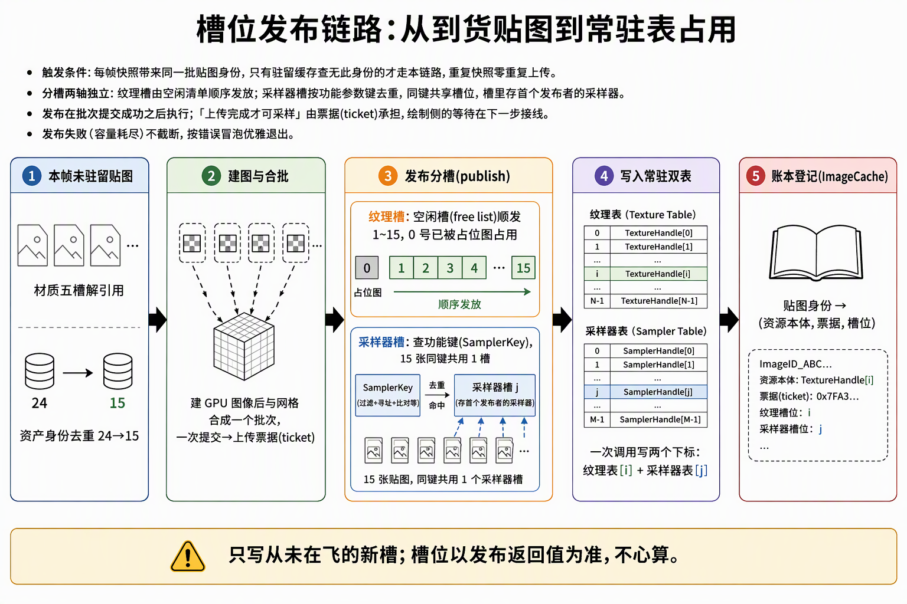
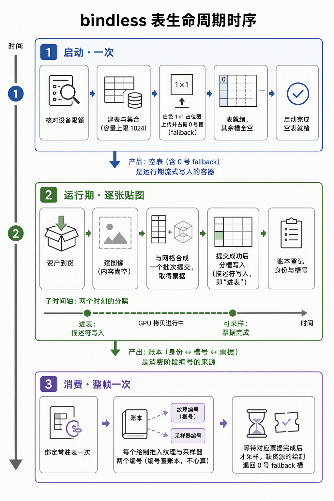

# 3.3.2-3.3.4-描述符与槽位：特性解禁、常驻描述符表与发布链路

> 2026-09-28。3.3 剩余三任务（3.3.2 特性与限额 / 3.3.3 描述符对象 / 3.3.4 槽位分配与发布）合并施工记录。前置知识见[描述符索引特性族篇](描述符索引特性族：能力位全景、三层配套与限额双轨.md)，闸门实证见[前置闸门施工记录](前置闸门施工记录：naga小样例与set-binding表冻结.md)。
>
> 实现落位：`vulkan/context.rs`（3.3.2 特性）+ `vulkan/descriptors.rs`（新模块，3.3.2 限额对账 + 3.3.3 表 + 3.3.4 槽位）+ `build.rs`（补丁器落地）+ `examples/descriptor_probe.rs`（生产表探针）+ `host.rs`/`upload.rs` 接线。

## 0. 判定线

**descriptor indexing 生产链全线解禁：设备创建显式启用五位、UAB 轨五项限额对账通过容量 1024、常驻双表（set0 纹理/采样器 + set1 每帧 UBO）三层配套成立、槽位发布沿上传票据落地——探针三组全绿 + 宿主实跑零 VUID + WM_CLOSE exit 0。**

验收点逐条：

1. **探针**（`cargo run -p ash_renderer --example descriptor_probe`）：组 A 设备五位支持 + UAB 限额实测；组 B 发布/去重/耗尽负例；组 C 生产表采样读回（蓝/绿/红全对）+ update-after-bind 改写实证——全程验证层 + 同步验证零告警。
2. **宿主实跑**：20/20 分位支持日志（D1 惯例）→ fallback 票据 #1 → 三批上传全部发布（mesh 6 + 贴图 15 张，纹理槽 16/1024、采样器槽收敛到 2 种）→ 零 VUID → WM_CLOSE exit 0 → 退出排空 + 反序拆除含描述符表。
3. **build.rs 补丁器**（2026-09-28 定案兑现）：定长模块原生过 spirv-val（零补丁）、runtime 模块被 VUID-04680 拒 → capability 补丁 → 复跑 spirv-val 兜底——naga 挪 build-dependencies，探针与 3.4 消费同一编译路径产物。

## 1. 3.3.2 特性与限额

**启用清单**（context.rs，与特性族篇 §2 定案一致）：`descriptor_indexing` 总开关 + `runtime_descriptor_array` + `shader_sampled_image_array_non_uniform_indexing` + `descriptor_binding_sampled_image_update_after_bind` + `descriptor_binding_partially_bound`。

- **硬校验**：五位缺一即 `Init` 出局（施工计划"缺少必要能力时明确报错，不建传统 bound 回退渲染器"），与 1.3 基线同款待遇。
- **D1 全量落账**：20 个分位支持值逐位进启动日志——"不启用≠不查"，后续段（SSBO 表、variable count）的证据已在日志里，不重新侦察。
- **限额对账**（descriptors.rs 建表内执行）：UAB 轨五项实测——每阶段/每 set sampledImages 1048576、每阶段/每 set samplers 1048576、全池总额 4294967295；容量 1024×2 张表 + 2 帧 UBO = 2050 描述符，五项全满足 → **1024 定案**。对账不过 = 显式报错，不静默截断。

**新钉号：UAB 限额不在 `PhysicalDeviceLimits` 里。**它们长在 properties2 扩展结构 `PhysicalDeviceDescriptorIndexingProperties`，须走 `PhysicalDeviceProperties2` + `push_next` 查询——与 Features2 查支持同一形状。"查 feature 走 Features2"纪律的 properties 侧对应物：**特性专属限额也在特性专属结构里**，普通 Limits 查不到就换结构，不是不存在。

## 2. 3.3.3 描述符对象

`BindlessTables`（vulkan/descriptors.rs）= set/binding 冻结表的 CPU 侧真身：

| 对象 | 形状 |
|---|---|
| set0 b0 | SAMPLED_IMAGE × 1024，`UPDATE_AFTER_BIND|PARTIALLY_BOUND`（经 `DescriptorSetLayoutBindingFlagsCreateInfo` 扩展结构，ash 0.38 无旗标字段） |
| set0 b1 | SAMPLER × 1024，同旗标 |
| set0 layout 创建旗标 | `UPDATE_AFTER_BIND_POOL`（VUID-03000 三层配套第二层） |
| set1 b0 | UNIFORM_BUFFER × 1，每帧一套（MAX_FRAMES_IN_FLIGHT=2），各配 64B host-visible UBO（identity 初值，3.5 写相机/灯光） |
| pool | `UPDATE_AFTER_BIND` 旗标（第三层），SAMPLED_IMAGE 1024 + SAMPLER 1024 + UNIFORM 2，max_sets 3 |

决策记录：

- **stage flags 取 COMPUTE|VERTEX|FRAGMENT 超集**：3.3 探针走 compute、3.4 走 graphics，超集只影响驱动优化面，不改变合法性；不为省一位去赌 3.4 不需要。
- **pipeline layout 不在建表链里**：push 96B 偏移 0/64/68/80 的 stage 归属（VERTEX/FRAGMENT）是 3.4 管线施工的决策，表只出 set0/set1 布局与集合句柄（`set0_layout()`/`set1_layout()`/`resident_set()`/`frame_set(i)`）。
- **采样器槽位去重**（3.3.4 定案，订正 e61781d2c 的落实）：键 = `SamplerKey`（滤波两轴 + mip 模式 + 寻址三轴 + 比较 + 边框色），即 `create_sampler` 消费的全部功能参数；sRGB/线性色彩角色不进键（格式解释挂 image view），lod clamp/aniso/bias 被全局策略钉死也不进键。**同键共享槽位，槽里存的是"首个发布者"的 VkSampler 句柄**。

## 3. 3.3.4 槽位分配与发布

- **free list**：bump 游标 + 回收栈；分配取回收栈顶，栈空取 bump，容量用尽报错（不越界不截断）。
- **fallback 槽 0**：白 1×1（UNORM 线性白）走同一上传链（fallback 票据 #1）占双表 0 号槽；采样器槽 0 的 linear 键登记后，**linear 键的真实贴图与 fallback 共享槽 0**（去重的自然结果——采样器是功能参数对象，fallback 与 linear 贴图同配方）。纹理槽 0 则由 fallback 独占，真实贴图从 1 号顺位。
- **发布 = 只写新槽**：`publish()` 从 free list 拿从未在飞的槽，M2 不改写已发布槽位——"不覆盖 pending draw 仍可能读取的槽"在结构上成立。改写已发布槽（UAB 的存在意义）由探针组 C 实证其语义，生产侧留给未来的资源更新路径。
- **释放入口的安全契约**（M2 不调用，运行时淘汰归步骤 4）：`retire_texture/retire_sampler` 前置条件三条——①该槽最后一次 GPU 使用的完成票据已等过；②采样器槽是多图共享的首发布者句柄借用，retire 前同键全部贴图先退场；③回收后再发布，新旧内容与票据完成无交叠。验证层对"在飞改写"不保证执法（契约类开关的责任转移），防线上只剩本契约。
- **票据接线**：发布发生在上传批次提交成功之后（与 `image_cache.commit` 同点）；"draw 访问新资源前有完成依赖"的 GPU 侧等待（ticket_semaphore 挂图形提交 wait 列表）归 3.4 接 draw 时落地——票据本体已在 `ImageCache` 账本行内。

生命周期时序全景：表一次建成（仅 fallback 占 0 号）→ 贴图随资产到货流式进表 → 消费阶段整帧绑一次、逐 draw 查账本推编号。「进表（描述符写入）」与「可采样（票据完成）」是相隔一段 GPU 拷贝时间的**两个时刻**——进表早于可采样，槽位有效不等于内容就绪：

## 4. build.rs 补丁器落地（定案兑现）

- naga 30.0.1 挪 build-dependencies（dev-dependencies 保留给 bindless_probe 内联路径）。
- 流程与闸门组 B 完全同形：每份 `examples/shaders/*.wgsl` → naga → **spirv-val 先验原生输出**（VULKAN_SDK 优先，回退 1.4.357.0 默认路径）→ 被拒才补丁 → 补丁后强制复跑 spirv-val 兜底 → `OUT_DIR/<stem>.spv`。
- 实测：`bindless_probe_fixed` 原生过（零补丁），`bindless_probe_runtime` 与 `descriptor_probe` 被拒 → 补丁 → 通过——"原生即合法"的证据面保留，与"runtime+补丁器"定案一致。
- **降级分支**：无 spirv-val 时构建降级为无条件补丁 + cargo:warning 明示证据链降级（补丁是纯声明性插词，合法性最终由验证层在 `vkCreateShaderModule` 内嵌执法兜底）；不把缺工具的静默当证据的红线不变。

## 5. 新钉号（实测执法记录）

| 钉号 | 内容 |
|---|---|
| **SAMPLER-UAB 无需特性位 → 已实测收账** | set0 b1 带 `UPDATE_AFTER_BIND|PARTIALLY_BOUND` 旗标创建 + 写入 + 采样读回，验证层零告警——特性族篇 §2.3 的"VUID 清单缺位推得"升级为实证 |
| **空槽访问 UB、验证层不保证能抓** | 探针首跑误用未写入的采样器槽 2（心算槽位 vs publish 实际账本），读回竟然"全对"且零告警——UB 的无害表现不可依赖；**槽位以 publish 返回值为准，不心算**。这正面实证了特性族篇 §0"契约类开关把时序安全责任转移给应用纪律" |
| VUID-03252（探针） | 探针设备特性集漏开 `timelineSemaphore`，Uploader 建 timeline 信号量即被抓——**特性集必须覆盖全部消费者**，复制特性配方时少一位就等这一刀 |
| VUID-00312（探针） | pool 无 `FREE_DESCRIPTOR_SET_BIT` 不得逐个 free——探针 set2 改为 pool 整体回收；生产表同理（pool Drop 整体回收，不逐 set free） |
| UAB 限额查询姿势 | 特性专属限额在 properties2 扩展结构（`PhysicalDeviceDescriptorIndexingProperties`），不在普通 Limits——见 §1 |

## 6. 边界与遗留

- **RenderDoc 验证未执行**（本机无 RenderDoc 环境）——README 验证条款 3 保持未勾，不以静默冒充证据；描述符可见性的工具级验证待环境就绪补做。
- **acquire 屏障归 3.4**：跨族 release 已随上传提交（image_releases），配对 acquire 挂图形族首个消费者——3.3 的探针同族不触发、宿主无图形消费，机制由 3.3.1 探针组 C 全链实证，接线归 3.4。
- **retire 双方法 M2 零调用**：释放入口为安全契约留档（§3），调用方纪律见方法 doc；运行时淘汰（含槽位-资源本体寿命联动账本）归步骤 4。
- **每帧 UBO 内容**是 identity 占位：相机/灯光数据写入归 3.5（写前等对应帧使用完成——帧槽轮转保证）。
- 采样器去重的句柄借用：槽里存首发布者的 VkSampler，GpuImage Drop 销毁其采样器——M2 靠"驻留资产与表同寿"成立，步骤 4 淘汰账本接管。
