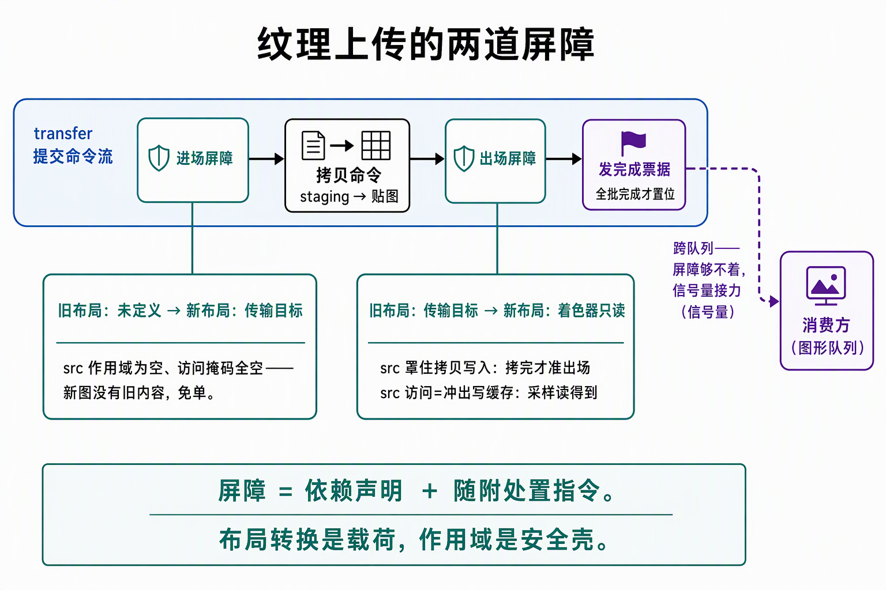

# Barrier家族：处置载荷、三种屏障与常见形状

> 2026-09-29,3.4 收官后的同步补课篇（本批三篇之三）。与《[GPU同步策略：以record_frame为例——进场屏障、提交等待与流水线阶段](GPU同步策略：以record_frame为例——进场屏障、提交等待与流水线阶段.md)》分工：那篇按帧走闸门，本篇是**工具目录**——屏障自己是什么、为什么能改资源状态、有几种、常见形状怎么配、本项目实际插了哪些（§4 总账）。纹理上传现场的内存拓扑与搬运流程见 3.2 的《[Buffer与Staging上传](../3.2-buffer侧上传/Buffer与Staging上传：三跳路径与内存堆拓扑.md)》《[Uploader：搬运收口](../3.2-buffer侧上传/Uploader：搬运收口、完成票据与frenderers对照.md)》。代码锚点：`ash_renderer/src/vulkan/frames.rs`、`vulkan/uploader.rs`。

## 0. 判定线

- **Barrier = 依赖声明 + 随附处置指令**：布局转换（oldLayout→newLayout）是它的**载荷**，src/dst 作用域是载荷的**安全壳**——"纯被动的路障"解释不了状态从哪变。
- **屏障执行四步**（GPU 执行到这条命令时，按序）：等 src 作用域收尾 → **执行布局转换**（真实设备操作：可能只是簿记，也可能真搬数据）→ 冲刷/使可见（srcAccess 的写落显存，按 dstAccess 对后续可见）→ 放行 dst 作用域。
- **UNDEFINED 作 oldLayout = 宣布旧内容作废**：驱动被豁免一切保留/搬运义务，转换趋近免费——这是 access 全空"免单"合法性的唯一来源。
- **三种屏障按绑定粒度分档**（全资源 / 单 buffer / 单 image 子资源）；**layout 字段只有图像版有**（buffer 没有布局概念）；族号字段管所有权（EXCLUSIVE 让渡才需要，CONCURRENT 一律 IGNORED）。

## 1. 屏障为什么能"驱动"状态改变

倒过来想就通：布局迁移**本身就是对这张图的一次写访问**（可能只是改簿记，也可能是真实的数据重排——布局背后是 GPU 按用途选的物理排布：传输爱线性、采样爱 tile、附件又一套）。既然是一次写，它就必须和前后的访问排序——而排序正是屏障的本职。Vulkan 把它做成独立"改布局"命令的话，你还得为它再配一道屏障；焊在一起，迁移被屏障自身的作用域免费保护。

这也解开了 D6 钉子的根因：**进场屏障的迁移是写操作，所以它的 srcStage 落点必须进"到图信号量"的等待作用域**（同步策略篇 §3.3）——不是屏障额外做了什么，是它的载荷本来就该按"一次写"排位置。

而"布局"这回事本身：GPU 按"图当前的服务对象"选最优物理组织——给 ROP 写、给采样、给线性拷贝各是一种排布。**布局 = "数据现在按什么物理组织摆着"的声明，屏障 = 声明"在这里换组织"的地方。**swapchain 图每帧在 PRESENT_SRC 与 COLOR_ATTACHMENT_OPTIMAL 之间来回，就是"给合成器看"和"给 ROP 写"两种形态的切换。

## 2. 三种屏障与两个边缘认知

一条 `cmd_pipeline_barrier` 收三个数组（frames.rs:389 的 `&[]`、`&[]`、`&[into_transfer]` 就是三槽）：

| 类别 | 绑定范围 | 独有字段 | 什么时候用 |
|---|---|---|---|
| 全局内存屏障 | **全部资源** | —— | 影响面大、写方多的统一收口（compute 批量产出）；本项目未用到 |
| 缓冲屏障 | 单个 buffer（可限 offset/size） | queue family ×2 | 池数据拷贝、所有权让渡 |
| 图像屏障 | 单张 image 的 subresource range | **old/new 布局** + queue family ×2 | 一切带布局迁移的现场 |

两个边缘认知：**subpass dependency = 渲染块内部的同款屏障**（字段与屏障完全同构；我们走 dynamic rendering，等于把声明式屏障换成了手插命令版）；**synchronization2 是同一语义的第二版接口**——uploader.rs:18-20 定案**不启用**，两套接口不混用，读规范时 2 版变体不用管。

## 3. 常见形状表

读法：**每行都是"在两段之间交接一份东西"**——进场单"无交接"（作废），出场单"有交接且收件人在流外"。背模板不如回到一句话：src 报"谁干完了什么写"，dst 报"谁要开工读什么"。

| 形状 | 阶段 src→dst | access src→dst | 布局 | 锚点 |
|---|---|---|---|---|
| 附件进场（作废旧内容） | 写颜色→写颜色 | 空→COLOR_ATTACHMENT_WRITE | UNDEFINED→COLOR_ATTACHMENT_OPTIMAL | frames.rs:376 |
| 深度进场（真空 src） | 深度测试→深度测试 | 空→DEPTH_STENCIL_ATTACHMENT_WRITE | UNDEFINED→深度附件 | frames.rs:403 |
| 附件出场（交呈现引擎） | 写颜色→管道底 | COLOR_ATTACHMENT_WRITE→空 | 可写→PRESENT_SRC | frames.rs:553 |
| 上传首用（免单进场） | 管道顶→搬运 | 空→TRANSFER_WRITE | UNDEFINED→TRANSFER_DST | uploader.rs:381 |
| 上传收尾（转可采样） | 搬运→管道底 | TRANSFER_WRITE→空 | TRANSFER_DST→SHADER_READ_ONLY | uploader.rs:447 |
| 同提交写后读（buffer） | 搬运→搬运 | TRANSFER_WRITE→TRANSFER_READ | —（buffer 无布局） | uploader.rs:470 |
| 池写→图形消费（同族回退形状） | 搬运→顶点输入/片段 | TRANSFER_WRITE→顶点属性读/SHADER_READ | — | memory_probe 闭环 |
| 离屏渲染→回采样（**将来必遇**） | 写颜色→片段 | COLOR_ATTACHMENT_WRITE→SHADER_READ | 可写→SHADER_READ_ONLY | 后处理/egui 接入标准形 |
| mipmap 逐层生成 | 搬运→搬运 | TRANSFER_WRITE→TRANSFER_READ | TRANSFER_DST→TRANSFER_READ（逐层） | 本项目 mip0 冻结未用 |
| 所有权让渡（EXCLUSIVE） | 各自按资源 | 写→空（dst 掩码被规范忽略） | buffer 无 / image 顺路携带 | uploader.rs:504、image_probe 组 C |

## 4. 项目屏障总账：19 道插入点

**生产 7 道 + 探针 12 道；按载荷分三类：布局转换 11 道（全在 image 屏障）、所有权让渡 3 道、纯依赖 5 道（全在 buffer 屏障）。** 图像屏障全带布局转换不是巧合——它们全部插在**使用点交接**现场，而每个使用点有布局契约（拷贝要 TRANSFER_DST、采样要 SHADER_READ_ONLY、ROP 要附件布局），使用点一变，布局状态机就必须走一步，转换必然顺路。buffer 没有布局概念，屏障于是"变纯"，只剩依赖与所有权两件事——"屏障即状态转移"的 D3D12 直觉（那边连 buffer 都有 ResourceState）在它身上落空。同一布局的 image 屏障（纯依赖，mipmap 逐层是标准现场）合法且常见，本项目尚未遇到。

> 数法："道" = 一处 `cmd_pipeline_barrier` 插入点；uploader 逐图循环里一道代表 N 张图，按图展开后更多。探针屏障为验证机制而插，生产对其零依赖。

### 生产（src/，7 道）

| 道位 | 类型 | 阶段 src→dst | access src→dst | 布局 | 在买什么 |
|---|---|---|---|---|---|
| frames.rs:376（每帧） | 图像 | 写颜色→写颜色 | 空→COLOR_ATTACHMENT_WRITE | UNDEFINED→COLOR_ATTACHMENT_OPTIMAL | 换 ROP 契约布局；srcStage 落"写颜色"=迁移落进 acquire 信号量等待作用域（D6：迁移是写，须排在合成器读之后）；dst 与 loadOp 清屏写收口 |
| frames.rs:403（每帧） | 图像 | 深度测试→深度测试 | 空→DEPTH_STENCIL_ATTACHMENT_WRITE | UNDEFINED→深度附件 | src 作用域真空，合法性由 wait_for_slot 的 fence 背书（上一轮使用已等完）；配套 loadOp CLEAR；storeOp DON'T CARE 故无出场 |
| frames.rs:553（每帧） | 图像 | 写颜色→管道底 | COLOR_ATTACHMENT_WRITE→空 | 附件→PRESENT_SRC | 画完才准交呈现引擎；写冲出缓存对呈现可见；换 present 专用布局 |
| uploader.rs:381（逐图） | 图像 | 管道顶→搬运 | 空→TRANSFER_WRITE | UNDEFINED→TRANSFER_DST | 免单进场：新图无旧内容；买 cmdCopyBufferToImage 的布局契约 |
| uploader.rs:447（逐图） | 图像 | 搬运→管道底 | TRANSFER_WRITE→空 | TRANSFER_DST→SHADER_READ_ONLY | 全单：拷贝干完+写冲缓存+换可采样布局；dst 空，真读依赖由消费方票据建立；CONCURRENT 双族族号 IGNORED |
| uploader.rs:470（逐源池） | buffer | 搬运→搬运 | TRANSFER_WRITE→TRANSFER_READ | — | 纯放行：同提交池→池拷贝写完才准读；无布局可换 |
| uploader.rs:504（逐 release 条目） | buffer | 搬运→管道底 | TRANSFER_WRITE→空（dst 侧被规范忽略） | — | 载荷=所有权让渡（family→to_family），配对 acquire 在接收族侧；生产正常路径恒空（uploader.rs:29 定案），形状保留+探针实证 |

### 探针（examples/，12 道）

| 探针 | 道位锚点 | 在验什么 |
|---|---|---|
| memory_probe | :437、:452（helper :499） | 生产写后读同款（TRANSFER_WRITE→TRANSFER_READ）；设备写→宿主读（TRANSFER→HOST，非 coherent 靠屏障+读侧 invalidate 兜底） |
| upload_probe | :770、:799 | 跨族 buffer acquire（src 阶段 ALL_COMMANDS 等 release、srcAccess 规范忽略置空、族号与 release 成对）；设备写→宿主读 |
| image_probe | :397、:431（组B，各一拖二）；:548、:568、:594、:612（组C） | 组B 回读往返 SHADER_READ_ONLY→TRANSFER_SRC→回（VUID-01397 读回不收 SHADER_READ_ONLY 的现场）；组C 跨族图像 acquire（old/new 与 release 同一对=所有权按对生效的实证钉）、自族迁入 TRANSFER_SRC、读毕迁回、宿主收口 |
| bindless_probe | :973、:1008（helper :1111） | 上传前后两道与生产同形状；access 按 layout 配对定案写死在 helper |

## 5. 现场实拆：纹理上传的两道屏障

屏障最密的现场是上传——每张贴图两道图像屏障，录在 transfer 提交的命令流内部（流程全貌见 Uploader 篇 §2 第 5 步）：

*读图：前置屏障是免单——新图无旧内容，src 作用域为空、access 全空；后置屏障是全单——src 罩住拷贝写（TRANSFER_WRITE 完成才准出场）、srcAccess 冲缓存（采样读得到）、顺路换到采样布局；跨队列那段屏障够不着，票据信号量接力。*

两道各在买什么：

- **前置（UNDEFINED→TRANSFER_DST）**：买布局契约——`cmdCopyBufferToImage` 的 VUID 执法要求目的地处于 TRANSFER_DST 布局。UNDEFINED 起点 = 作废旧内容（新图本来没内容），免单。
- **后置（TRANSFER_DST→SHADER_READ_ONLY）**：四样全占——布局换到采样契约、srcStage 保证拷贝**干完**、srcAccess 把像素写**冲出缓存**（没有这行就是"stage 配对 access 空着=静默翻车"的活例）、dst 作用域为空（本提交内无消费者，真正的读依赖由消费方的票据等待建立）。

**为什么不能合成一道 UNDEFINED→SHADER_READ_ONLY？**布局是每个使用点的契约：拷贝要求 TRANSFER_DST、采样要求 SHADER_READ_ONLY——布局是条状态机，从一个使用点走到下一个使用点必须迁移，中间态跳不过去。

## 6. Unity / D3D12 收尾

D3D12 的 `ResourceBarrier` 把载荷暴露得更直白——参数**只有**状态转移，没有阶段/访问掩码（由运行时按状态机推）；而且它连 buffer 都有 `ResourceState`，对 buffer 同样要插转移。Vulkan 删掉 buffer 布局，buffer 屏障于是只剩依赖与所有权（§4 总账里纯依赖道位全落在 buffer 屏障）。Unity 在 `SetRenderTarget`、纹理上传这些点替你插好了同款；Vulkan 拆成"布局+阶段+访问"三个维度，代价是四掩码自配，收益是每一步可控可省。

**自测四问**（能答出才算过）：
1. 屏障执行四步是什么？"转换是载荷、作用域是安全壳"怎么对应到这四步？
2. 免单（access 全空）的合法性来源是什么？上传的两道屏障里哪道是免单、哪道是全单？
3. 图像屏障独有而缓冲屏障没有的字段是什么？为什么 buffer 不需要它？
4. 项目 19 道屏障按载荷分三类各几道？为什么图像屏障全带布局转换、buffer 屏障却"空手"？
