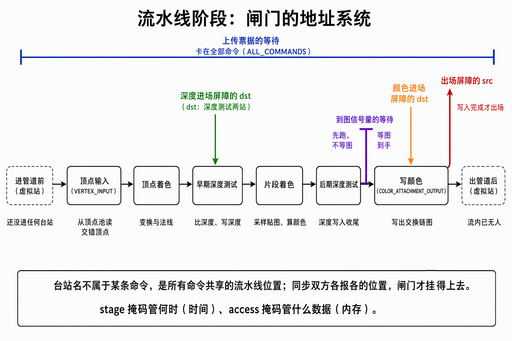
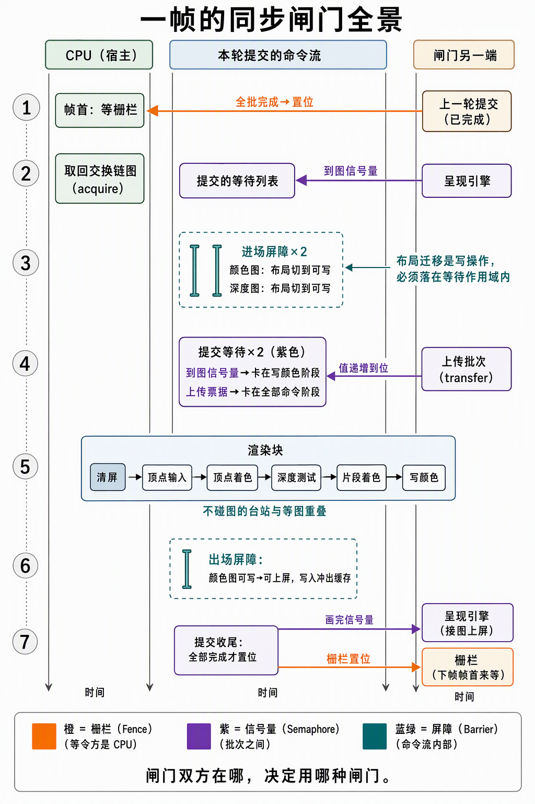

# GPU同步策略：以record_frame为例——进场屏障、提交等待与流水线阶段

> 2026-09-29,3.4 收官后的同步全景篇。三篇接力：《[帧流程：一帧之内各Vulkan对象如何接力](../../2-宿主壳/材料/帧流程：一帧之内各Vulkan对象如何接力.md)》在**角色层**回答"谁置位、谁等待"；《[PipelineStage：屏障与信号量的共同语言](../../2-宿主壳/材料/PipelineStage：屏障与信号量的共同语言.md)》在**语法层**回答"四种掩码怎么配"（注意其 §2.1 的进场屏障 `src=TOP_OF_PIPE` 是 D6 修复前的旧形状）；本篇是**应用层**——把语法装回一个真实函数，按执行顺序走完一帧，每道闸门回答"拆掉它会坏什么"。代码锚点：`ash_renderer/src/vulkan/frames.rs`（`record_frame` / `wait_for_slot`）、`ash_renderer/src/host.rs`（`draw_frame` 帧首调用与 DrawList 组装）。讲的是 3.4 定稿版——深度附件、上传票据、双进场屏障都在场的完整形状。

## 0. 判定线

- **GPU 上两批工作之间默认没有任何顺序。**同一队列先后提交只保证"进队顺序"，执行重叠是常态；跨队列更什么都不保证。一切顺序都是同步原语显式买来的——同步的全部工作，就是为**确实存在的依赖**买单，一处不多、一处不少。
- **闸门只有三种，按"焊在哪"选**：命令流内部→屏障（Barrier）；队列操作之间→信号量（Semaphore）；等令方是 CPU→栅栏（Fence）。判定线一句话：**闸门双方在哪，决定用哪种闸门。**
- **一切闸门都用流水线阶段当地址**：stage 掩码管"何时"，access 掩码管"什么数据"。
- **等待是"卡在某个阶段"，不是"整批冻结"**：等待阶段之前的台站照常开跑。
- 一帧 `record_frame` = **两道批间等待 + 三道流内屏障 + 一条栅栏的两端 + 两枚置位信号**（§2 总表）。

## 1. 流水线阶段：命令是段，不是点

同步概念的第一个坎在这里：**"清完屏再画三角形"这句话，翻译给 GPU 时"清完"没法指**。命令缓冲里的命令按序提交，但 GPU 是流水线——命令不是先后跑完的点，是横跨多个台站的段：第 2 个 draw 的顶点处理，可以和第 1 个 draw 的写颜色**同时在不同的台站跑**。所以"清完"必须精确到台站：不是"清屏命令结束"，而是"清屏在写颜色台站的写入干完"。

图形链的台站，按流水顺序（本帧每站在干什么）：

| 台站 | 本帧这里发生的事 |
|---|---|
| 顶点输入（VERTEX_INPUT） | 从顶点池读交错顶点（30.4MB 的 FlightHelmet 数据在这被读） |
| 顶点着色（VERTEX_SHADER） | `push.model * position`，法线 cofactor 变换 |
| 早期深度测试（EARLY_FRAGMENT_TESTS） | reverse-Z GREATER 比深度、写深度 |
| 片段着色（FRAGMENT_SHADER） | bindless 采样 base_color，Lambert 着色 |
| 后期深度测试（LATE_FRAGMENT_TESTS） | 深度写入收尾 |
| 写颜色（COLOR_ATTACHMENT_OUTPUT） | ROP 写出，SRGB view 编码 |

两端还有**虚拟站**：进管道前（TOP_OF_PIPE，还没进任何台站）、出管道后（BOTTOM_OF_PIPE，已出所有台站）。以及一条合订快捷键：**全部命令（ALL_COMMANDS）**= 所有台站全选。

关键认知：**台站名不属于某条命令，是所有命令共享的"流水线上的位置"**。同步双方各报各的位置——屏障的 src/dst、信号量等待的 dst——闸门才挂得上去。这就是"PipelineStage 是屏障与信号量的共同语言"的全部含义，也是把三个重点串起来的那根线：**进场屏障挂在台站之间，提交等待挂在台站上，而流水线就是这份地址表本身。**



*读图：六个台站加两端虚拟站是本帧的地址表；五枚标记各自锚在所属台站——深度进场屏障锚在深度测试（不是写颜色）、到图信号量卡在写颜色正前方（先跑/等图到手）、颜色进场屏障与出场屏障一进一出同锚写颜色、上传票据横跨全部。*

## 2. 一帧的闸门地图

先把全景钉死，再逐段拆。按执行顺序，一帧 `record_frame` 里全部闸门：



*读图：三条泳道，时间自上而下；橙=栅栏（到 CPU）、紫=信号量（批次之间）、蓝绿=屏障（命令流内部）。第 3 排两道进场屏障落进第 4 排等待的作用域（§3.3 的耦合）；第 7 排两枚置位分别交给呈现引擎（接图）与栅栏（下帧帧首来等）。*

| 闸门 | 类型 | 焊在哪 | 等待方 ← 置位方 | 拆掉坏什么 |
|---|---|---|---|---|
| in_flight 栅栏 | 栅栏 | 批尾置位→下帧帧首等（`wait_for_slot`） | CPU ← GPU 全批完成 | 重录仍在飞的一帧：命令缓冲、深度图被覆盖 |
| 到图信号量（image_available） | 信号量·二值 | 提交等待 @写颜色 | 本批从写颜色起卡 ← 呈现引擎置位 | 画一张还没交出来的图 |
| 上传票据（ticket） | 信号量·timeline | 提交等待 @全部命令 | 本批全链卡 ← 上传批次置位（值递增） | 消费没传完的顶点/贴图 |
| 颜色进场屏障 | 屏障 | 命令流内 | 未定义→可写，dst@写颜色 | 布局不合法；迁移写与 present 读相撞 |
| 深度进场屏障 | 屏障 | 命令流内 | 未定义→深度可写，dst@深度测试 | 深度附件布局不合法 |
| 出场屏障 | 屏障 | 命令流内 | 可写→可上屏，src@写颜色+冲缓存 | 呈现引擎读到写缓存里的旧值 |
| 画完信号量（render_finished） | 信号量·二值 | 提交置位 | 呈现引擎接图 ← 本批全批完成 | present 抢跑读到半成品 |

读法：**栅栏一分为二写在一行**——批尾 `queue_submit` 的 fence 参数是供给端，下帧 `wait_for_slot` 是消费端，同一对象。三种闸门各就各位之后，§3、§4 按顺序拆每一道。

## 3. 提交等待：两道批间闸门

信号量不进命令缓冲，挂在 `queue_submit` 的等待列表里。等待的语法只有一个旋钮，却是全篇的钥匙：**`wait_dst_stage_mask`（从哪个阶段起卡住）**。

### 3.1 到图信号量：只挡用图的那一刻

```
wait: [image_available]  @ COLOR_ATTACHMENT_OUTPUT
```

精确含义：**本批提交里，写颜色台站之前的部分立即开跑、不必等图；从写颜色起卡住，直到呈现引擎置位。**这不是"整批等图"，是"只挡住用图的那一刻"。本帧第一个用图的动作就是 `loadOp` 清屏——它被挡到图真正到手；顶点输入、顶点着色这些不碰图的台站与等图重叠。旋钮拧成"进管道前"（TOP_OF_PIPE）则全批冻结，重叠窗口全部关闭——**这是性能旋钮，不是正确性旋钮**。

反向的那道（`render_finished`，本批全批完成才置位、呈现引擎等它接图）没有旋钮：信号量**等令侧有旋钮、发令侧固定"对面整批全部干完"**，且内存隐含全量——present 接图不需要任何补充屏障。

### 3.2 上传票据：GPU 侧等，不是 CPU 等

```
wait: [ticket_semaphore]  @ ALL_COMMANDS, value = wait_ticket
```

上传批次（transfer 提交）写完顶点池和贴图，图形批次才能消费——这是一道真实的批间依赖。卖点是**等待发生在 GPU 执行依赖处**：`queue_submit` 的等待列表里多挂一项，CPU 不阻塞、帧循环照跑、录制照做；GPU 在执行到"全部命令"前等 timeline 信号量的值达到票据号。若等在 CPU（等 fence 再提交），帧循环直接空转，把并行折回串行。

两处细节：timeline 是带数值的信号量，上传方每次提交 signal 递增的票据号，图形方按值等待（值 0 禁止等待，VUID-03242，故代码里 0 走跳过分支）；等待钉在 ALL_COMMANDS 而不拆到具体台站（顶点池其实只有顶点输入台站读、贴图只有片段采样读）——**粗而正确**，拆细的收益配不上账本复杂度。这道等待同时把 transfer 写对池/贴图的**内存可见性**收口（池与贴图 CONCURRENT 双族共享，无所有权屏障，3.4 定案）。

### 3.3 等待作用域圈住了进场屏障——两道闸门的耦合

这是本篇最值钱的一课，也是 D6 缺陷的教训。**提交等待的 dst 阶段不只是挡命令，它圈出一个"作用域"：被挡住之前，作用域内的写不得执行。**

颜色进场屏障做布局迁移——迁移本身是**一次对图的写**。若把这次写钉在"进管道前"（TOP_OF_PIPE），它落在等待作用域之外：提交一执行、不等图到手，迁移先跑——与呈现引擎对这张图的**最后一次读相撞**，验证层当场抓 WRITE_AFTER_READ（V1 执法轮实抓）。修法就是把迁移写**钉进"写颜色"台站**，落进到图信号量的等待作用域，迁移被挡到图真正到手之后。

一句话：**进场屏障不是独立闸门，它的 src 位置是"挂在哪道提交等待的作用域里"这个问题的答案**——这是重点一和重点二的耦合处，也是下一节拆屏障时的前提。

## 4. 进场屏障：流内的两份交接单

屏障是命令流里的一条命令，宣布："左边这些台站的这些访问收尾，右边这些台站的访问才准开工。"四个掩码的语法在同步语义篇 §2，这里只拆 3.4 定稿版的三道怎么配、为什么。

### 4.1 颜色图：一份"无交接"的单

| 参数 | 值 | 为什么 |
|---|---|---|
| old→new 布局 | 未定义 → 可写（COLOR_ATTACHMENT_OPTIMAL） | acquire 拿回的图布局不定；**未定义同时宣布"旧内容作废"** |
| src 侧 | 写颜色台站，access 空 | **src 落点=§3.3 的答案**：钉进等待作用域；access 空=没人要读旧内容，无内存需冲刷 |
| dst 侧 | 写颜色台站 + COLOR_ATTACHMENT_WRITE | 布局切换赶在第一次用新布局（清屏写）之前生效；dst_access 与清屏写收口 |

和步骤 2 时代的差别只有一处：src 从 TOP_OF_PIPE 改到写颜色——**语法没变，是 §3.3 那道耦合逼出来的落点**。

### 4.2 深度图：UNDEFINED 与空作用域的合法性

| 参数 | 值 | 为什么 |
|---|---|---|
| old→new 布局 | 未定义 → 深度附件可写（DEPTH_STENCIL_ATTACHMENT_OPTIMAL） | 与 `loadOp CLEAR`（清 0，reverse-Z 近平面）配套：旧深度不要了 |
| src 侧 | 早期+后期深度测试，access 空 | **src 作用域是真空**：这张深度图上一轮的使用已被 `wait_for_slot` 的 fence 等完，录制时不存在并发引用——屏障只是钉位，没有真的在等任何东西 |
| dst 侧 | 早期+后期深度测试 + DEPTH_STENCIL_ATTACHMENT_WRITE | 深度图被用的台站就是深度测试，不是写颜色 |

对比出纪律：**access 全空的合法性来自"没有交接"**——颜色图作废旧内容、深度图作废+fence 隔离。若同一帧内两次使用同一张图（比如 3.3 时代 EXCLUSIVE 的 release/acquire 成对屏障），交接真实存在，src access 就必须报名。**出场侧同理**：storeOp DON'T CARE + 下帧未定义重进，深度无出场屏障——没有交接，连单都不用开。

### 4.3 颜色图的出场：两段式交接

出场屏障（可写→可上屏 PRESENT_SRC_KHR，src@写颜色 + src_access=COLOR_ATTACHMENT_WRITE）只完成交接的一半：**布局换到呈现引擎专用 + 把颜色写入冲出写缓存**。另一半在批外：`render_finished` 置位后呈现引擎才接图（§3.1 反向那道）。**接收方在流水线外面**，流内没有台站可放行，dst 写到 BOTTOM_OF_PIPE 即可，可见性由信号量的批间语义接力——屏障与信号量的分工在一份交接上看得最清楚。

## 5. 复杂度守恒：同步买的是什么

一帧七道闸门，看着密，其实每道都在为一笔真实的依赖付费：栅栏买"重录安全"，到图信号量买"图的所有权"，票据买"上传完成"，三道屏障买"布局合法+缓存纪律"，画完信号量买"上屏完整"。**没有一道是仪式。**反过来说，去掉任何一道，省下的只是闸门开销，换来的是数据竞争——而数据竞争在 Vulkan 里多数不报错，只给你脏画面或 UB。

Unity / D3D12 视角收个尾：这些在 Unity 里**不是不存在，是被托管了**——布局切换由运行时按资源状态推断并插屏障（D3D12 的 ResourceBarrier 形状）、等待点由运行时打包选保守位置。裸 Vulkan 把旋钮全露出来的意义，就是省掉那些保守选择的开销；代价是四个掩码、三个对象、七个落点自己配——本篇就是这份配置单的逐项理由。

## 6. FAQ 与自测

**Q：为什么不把所有等待都钉成 ALL_COMMANDS 一劳永逸？**
合法，但把可重叠的台站全冻住（§3.1 的教训反向）。到图信号量钉写颜色是性能必需；票据钉 ALL_COMMANDS 是"粗而正确"的自愿选择——同一旋钮，两处依据不同。

**Q：逐 draw 的 push constants 为什么完全不需要同步？**
push 数据录进命令缓冲本身，是命令的参数，随命令流天然保序——闸门只管共享资源（池、贴图、附件），不管"流里自带的行李"。

**Q：栅栏和 timeline 信号量都能被 CPU 查状态，为什么帧闸门用栅栏？**
"本批提交完成"最直接的载体就是 `queue_submit` 的 fence 参数，语义直白；timeline 信号量的身份是"多批次之间的计数接力"（票据链），两者各司其职。

**自测三问**（能答出才算过）：
1. 到图信号量的等待钉在"写颜色"——钉成"进管道前"损失什么？钉错了（作用域外）会犯哪类错？
2. 颜色进场屏障的 srcStage 为什么必须是"写颜色"？它和哪道提交等待耦合？
3. 颜色图与深度图的进场屏障，谁的 src 作用域是"真空"？各自的合法性证据来自哪道闸门？
