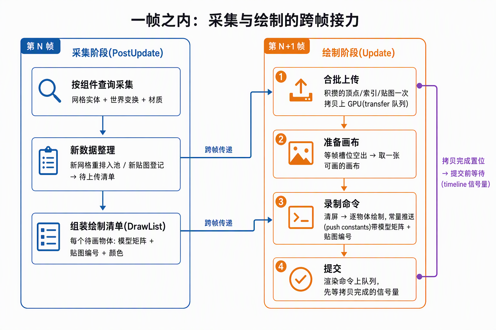

# 施工计划：Bindless 起步五段拆解

> 2026-09-22 建档。步骤 3 主计划，对应 [README](README.md)。行号/结论基于本仓库 checkout（0.20.0-dev）。
> 你此前没写过 Bindless——§1 先把机制讲透再拆活；每段施工配套的深水区（描述符细节、同步细节）在**当段的记录文档**里展开，本文只立骨架。

## §0 判定线（完成标准，不可退让）

1. **窗口里出现 FlightHelmet**：几何完整、贴图正确、光照方向与 bevy wgpu 渲染一致；
2. **同屏对照通过**：与 bevy 自带 wgpu 渲染（临时开对照窗口）肉眼比对几何/贴图/光照方向；
3. **架构落点对**：`Assets<Mesh>` 直读（禁渲染后主世界数据常驻）、合批上传（超越 frenderer"每 primitive 两次 wait_idle"）、bindless 起步形态 = descriptor indexing；
4. **验证层零告警**：VK_LAYER_KHRONOS_validation 的 WARNING/ERROR 在完整跑通后清净；
5. **两 Tier 纪律延续**：帧循环兜底用糖、装配失败冒泡、禁 `panic!`/`unwrap()`/`expect()`。

## §1 Bindless 入门：它到底改了什么

**先看 bind 模型的形状**（frenderer 就是你写过/读过的基准，步骤 6 还要拿它做 A/B）：

```text
每个 draw 之前，CPU 要把这个 draw 用到的资源"绑"到管线槽位上：
  vkCmdBindDescriptorSets(本 draw 的 descriptor set)   ← set 里预装了本 draw 的贴图/UBO
  vkCmdBindPipeline / vkCmdBindVertexBuffers / vkCmdBindIndexBuffer
```

痛点在 **descriptor set 的生产方式**：bind 模型下"一个材质/一次变体 = 一个 descriptor set"，set 数量随对象数线性涨；每帧 CPU 还要维护这些 set、算哪个 draw 换哪套 bind——**CPU 每对象装配成本**，正是大世界的死穴。frenderer 每帧"现场收集 RenderElement → 排序 → 逐个 bind"就是这条路的完全体，所以它只能到万级实体。

**bindless 的解法（descriptor indexing，Vulkan 1.2 核心）**：把贴图从"每次 bind 换一批"改成**一张巨大的常驻数组**——

```glsl
layout(set = 0, binding = 0) uniform sampler2D textures[];   // 不定长数组
...
vec4 base = texture(textures[nonuniformEXT(push.tex_index)], uv);
```

- 贴图上传成功时往数组里**补写一个槽位**（`vkUpdateDescriptorSets`，update-after-bind：提交中的 set 也能改）；
- draw 时不再 bind 贴图——**push constant 里带一个 `tex_index`**，shader 自己去数组里取；
- set 只分配一次、终身复用，draw 之间的 CPU 装配成本从"换 set"塌缩成"传一个整数"。

**四件套 feature**（全部 Vulkan 1.2 `VkPhysicalDeviceVulkan12Features`，设备创建时一次性打开，细节施工 3.3 逐个讲）：

| feature | 回答的问题 |
|---|---|
| `descriptorIndexing` + `runtimeDescriptorArray` | 总开关：shader 里允许不定长数组 |
| `shaderSampledImageArrayNonUniformIndexing` | 允许用**非一致**索引（每 draw 不同的 tex_index）取数组 |
| `descriptorBindingSampledImageUpdateAfterBind` | 允许 set 已提交 GPU 还在跑时**继续补槽位**（异步加载不断帧） |
| `descriptorBindingPartiallyBound` | 允许数组里**空槽存在**（不必一次写满 1024 个） |

**Unity 映射**：bind→bindless 的演进同构于 SRP Batcher（减少 SetPassCall 的换绑成本）→ GPU Resident Drawer（GPU 自取数据，CPU 每对象成本趋零）。你练的本步 = 后者的数据侧地基：**索引常驻、按需补槽**。

**本步边界**：bindless 起步形态 = **贴图走 descriptor indexing**；顶点数据仍走传统顶点缓冲（大池 + 偏移），UBO 走每帧一份。descriptor buffer（Vulkan 1.4 的后继方案）按路线图留到 步骤 6 收尾替换。

## §2 终态设计（一帧之内）



关键决策（每条的取舍在当段记录里展开）：

| 决策 | 选择 | 一句话理由 |
|---|---|---|
| 顶点布局 | SoA→交错重排 `pos+normal+uv`（32B） | bevy 分列存储，GPU 顶点取数要交错；一次重排终身受益 |
| 池策略 | 顶点/索引各一个 DEVICE_LOCAL 大池 + bump 偏移 | 超越 frenderer"每 buffer 独立 allocate + wait_idle" |
| 上传 | 合批 staging，一次 flush 一个提交 | 同上；拷贝队列起步（路线图原话），RTX 2060 有专用 transfer 族 |
| 跨队列同步 | **timeline 信号量**（1.2 特性） | 拷贝完成 → 绘制才读；二进制信号量表达不了"第 N 批完成"；步骤 4 增量上传直接复用 |
| bindless | set0 = 贴图数组（1024 槽，UPDATE_AFTER_BIND + PARTIALLY_BOUND，一次分配终身用）；set1 = 每帧在飞一份 UBO（相机+灯光，×2） | 前者终身不变，后者每帧变——寿命不同必须分家（步骤 2 分家思想的延续） |
| per-draw 参数 | push constants：`model` 矩阵 + `tex_index` + `base_color` | 84B < 128B 保底上限；draw 间零换绑 |
| 着色语言 | **WGSL**，naga（依赖树内 30.0.1）编译 SPIR-V | 本机无 Vulkan SDK/glslang；顺路对齐 bevy 着色语言，步骤 5/6 抄 WGSL 内核不吃第二遍语法 |
| 深度 | D32_SFLOAT，随 swapchain 重建建/拆 | resize 级寿命，归 Swapchain 管（步骤 2 分家清单补员） |
| 采集时机 | PostUpdate，`.after(TransformSystems::TransformPropagate)` | 入口篇既定架构（帧末直读），拿到本帧最终矩阵 |
| 帧循环 | `draw_frame` 编排不动，录制段从清屏长成"上传 flush + 清屏 + 绘制" | 步骤 2《搭建记录》§6 给 步骤 3 的接口承诺 |
| 代码结构 | main 只做统筹（插件组装，零 Vulkan 符号），编排住 `host.rs` 宿主桥（2026-09-22 开工整理） | 3.2~3.5 每段都要长帧循环，装配与编排一次分家；新模块照 scene 样式自含插件落位，见[《代码结构整理：main只做统筹（宿主桥分家）》](材料/代码结构整理：main只做统筹（宿主桥分家）.md) |

## §3 五段拆解（一次一段；每段一个子文件夹存放该段任务面板与施工文档）

### [施工 3.1：ECS 侧取数](3.1-ECS侧取数/README.md)（零 Vulkan 代码）

**目的**：先让数据在 ECS 里看得见——这是"取数链路"的取数半边，Vulkan 半边全部后置。

**做什么**：
1. 材质缝接线（步骤 2 遗留）：`init_asset::<StandardMaterial>()` 注册容器；官方 `GltfExtensionHandlerPbr` 是 `pub(crate)` 拿不到，但转换函数 `standard_material_from_gltf_material` 是 pub——**自写 AshMaterialHook 实现三钩子**（on_root 兜底材质 / on_material 转换 / on_spawn_mesh_and_material 插 `MeshMaterial3d`），注册进 `GltfExtensionHandlers`；
2. Startup：`asset_server.load` FlightHelmet + spawn `WorldAssetRoot`；手动 spawn 相机（`Camera` + `Projection` + `Transform`）与方向光/环境光；
3. PostUpdate 采集系统 `collect_scene`：Query 采集 `Mesh3d`/`GlobalTransform`/`MeshMaterial3d`，`Assets::get` 容忍空帧（异步到货），日志报实体数/顶点数/材质数。

**验证**：日志稳定报出 FlightHelmet 的实体数、每 primitive 顶点数、6 材质 15 贴图；无 panic；清屏循环不受影响。

### [施工 3.2：buffer 侧上传](3.2-buffer侧上传/README.md)（顶点/索引进池）

**目的**：数据从 `Assets<Mesh>` 进 GPU 大池，合批 + 拷贝队列起步。

**做什么**：
1. Context 扩展：寻找 transfer 专用队列族（`QUEUE_TRANSFER` 且无 GRAPHICS；没有则退回 graphics 队列合批），`Vulkan12Features` 开 `timelineSemaphore`；
2. 新模块 `resources.rs`：内存类型选择 helper、顶点/索引池（bump 分配）、staging 池；
3. Mesh→顶点交错重排（pos/normal/uv + U16/U32 索引），进 pending 队列；`flush_uploads`：一次 flush = 一个 staging buffer + 一个提交 + timeline 置位；draw_frame 的渲染提交等 timeline（`VERTEX_INPUT` stage）。

**验证**：上传字节日志与 Assets 侧统计一致；RenderDoc 确认池 buffer 就位；连续加载无 `wait_idle`（对比 frenderer 基准）。

### [施工 3.3：贴图 + bindless 描述符](3.3-贴图与bindless描述符/README.md)

**目的**：贴图上 GPU + descriptor indexing 全套落地——**本步的练习核心**。

**做什么**：
1. `Assets<Image>` → VkImage（格式映射，base_color 走 SRGB view）+ 采样器（读 `Image::sampler` 设置）；上传进贴图 pending，同一条 timeline 链；
2. 四件套 feature 全开（含 `runtimeDescriptorArray` 等，§1 表为准）+ 池/布局/集合：set0 一次分配 1024 槽（槽位分配器：free list），上传完成即补槽；set1 每帧在飞一份 UBO；
3. 本段配套**描述符原理篇**记录文档：从 bind 模型到 update-after-bind 的每个 flag 回答什么问题（对 §1 展开成逐 flag 深水区）。

**验证**：验证层零告警（本步最值钱的检查点，装 SDK 补验证层的建议兑现）；RenderDoc 可见贴图数组。

### [施工 3.4：管线与绘制](3.4-管线与绘制/README.md)（第一次看到头盔）

**目的**：从"清屏"长成"画场景"。

**做什么**：
1. WGSL 两支（vert：顶点变换；frag：nonuniformEXT 取贴图 + 简单光照），naga 运行时编译 SPIR-V（启动期一次，失败走 Tier② 冒泡）；
2. 图形管线（dynamic rendering：颜色附件 + 深度附件；动态 viewport/scissor；背面剔除先关、验证绕向后开）；
3. 深度缓冲进 Swapchain（随重建建/拆）；`record_clear_and_submit` → `record_frame`：上传 flush → 清屏 → 逐 draw（push constants：model/tex_index/base_color）；
4. DrawList 接进录制段。

**验证**：头盔出现在窗口，几何完整无破面；resize/退出链路复测不回退。

### [施工 3.5：光照与同屏对照](3.5-光照与同屏对照/README.md)（收官）

**目的**：过 §0 判定线，落文档。

**做什么**：
1. 方向光 + 环境光读进 UBO（bevy 组件数据 → 每帧写映射内存）；`unlit`/`alpha_mode` 材质本步按简单策略处理并记录取舍；
2. 同屏对照：bevy wgpu 渲染同场景 vs 本渲染器，比对几何/贴图/光照方向（判定线②）；
3. 收官文档：搭建记录（终态架构 + 坑表 + 证据）+ 路线图翻状态 + 入口篇登记。

**验证**：§0 全条打勾。

## §4 本步不做（防 scope 蔓延）

- 增量上传/热重载/脏标记（步骤 4）；mipmap 生成（贴图 mip0 直出，步骤 6 流送再议）；多材质管线变体（alpha blend 等，本步只画 opaque，透明材质记录后丢弃）；蒙皮/动画；GPU 剔除与 indirect（步骤 5/6）；descriptor buffer（步骤 6）；完整 PBR（本步 Lambert 级漫反射即可支撑"光照方向一致"判定，材质参数暂只取 base_color + 贴图，metallic/roughness 留 步骤 4+）。

## §5 节奏约定（本步与 步骤 2 的差异）

- **一次只施工一段**：段落跑通即停，我（agent）结合代码讲解该段核心机制 → 你消化/提问/复述 → 你确认后才进下一段；
- 每段产出小节记录（可并入当段讲解，踩坑即记不攒）；
- 计划可在段间修订，但 §0 判定线与"一次一段"节奏不动。

## §6 已核实事实（0.20.0-dev，实施依据）

1. `GltfExtensionHandlerPbr` 是 `pub(crate)`（bevy_pbr/src/gltf.rs:102），外部不可注册；`standard_material_from_gltf_material` 是 pub（同文件 :33），三钩子逻辑可自写复刻；
2. `GltfExtensionHandler` trait 在 bevy_gltf/src/loader/extensions/mod.rs:62，`on_root` 有默认空实现，`dyn_clone` 必须实现；
3. `GltfPlugin`（含 `GltfExtensionHandlers` 资源）独立于 RenderPlugin，禁渲染下照常工作；
4. `DirectionalLight`/`AmbientLight` 在 bevy_light crate（0.20 拆分后），方向光沿实体 forward 照射（directional_light.rs:25）；**全局环境光真身 = `GlobalAmbientLight` 资源（LightPlugin 预插，默认亮度 80）**——`AmbientLight` 在 0.20-dev 已是组件（ambient_light.rs:11 `#[require(Camera)]`，挂相机覆盖全局），早版记"AmbientLight 是全局 Resource"系按旧版记忆，2026-09-22 侦察订正（见 3.1.3 §3）；
5. `PerspectiveProjection`/`Projection` 在 bevy_camera/src/projection.rs；
6. naga 30.0.1 已在依赖树（bevy_shader 经 wesl 间接依赖），加 `naga = { features = ["wgsl", "spv"] }` 即得 WGSL→SPIR-V，本机无需 Vulkan SDK；
7. 本机无 glslangValidator/glslc/Vulkan SDK（2026-09-22 实查）——着色器编译只能走 naga 路线；
8. FlightHelmet：1 gltf + 1 bin + 15 png（6 材质，BaseColor/Normal/OcclusionRoughMetal 三类共 15 张；早版记"4 材质"系笔误，2026-09-22 实测订正），无内嵌相机灯光，需手动 spawn；
9. 禁渲染后 `Assets<Mesh>` 主世界数据永久可读（步骤 2《搭建记录》§6，glTF 链路篇 §6 结论）。
