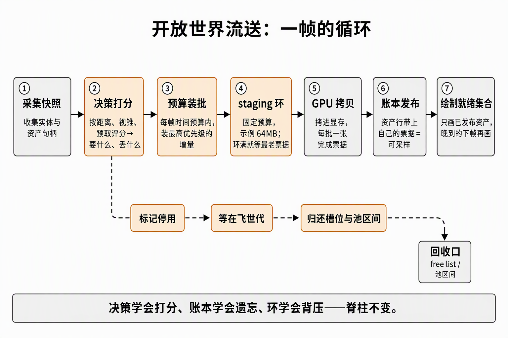

# 开放世界流送设计：滑动窗口驻留、淘汰与预算环

> 2026-09-29,**设计前瞻篇（未施工）**——由"假设头盔场景是开放世界"的问答定稿，落位步骤 4~6 的预定形状（3.2 README 待决冻结的"频繁增量增长和流送预算"由此接走）。基座现状：《[Uploader：搬运收口、完成票据与frenderers对照](../3.2-buffer侧上传/Uploader：搬运收口、完成票据与frenderers对照.md)》（提交收口+票据）、《[Buffer与Staging上传：三跳路径与内存堆拓扑](../3.2-buffer侧上传/Buffer与Staging上传：三跳路径与内存堆拓扑.md)》（内存拓扑）、《[责任边界冻结](../3.2-buffer侧上传/责任边界冻结：上传完成、图形消费与退出排空的时序契约.md)》（四等待面）。锚点文件：`upload.rs`、`vulkan/{uploader,pool,descriptors}.rs`、`scene/collect.rs`。

## 0. 判定线

- **开放世界改变的不是"上传"，是"驻留"的定义**：全集驻留 → **滑动窗口驻留**（工作集随相机移动）。三件套 = 决策（要什么/丢什么）+ 驻留（留什么，含淘汰）+ 流水线（怎么搬）——M2 只有第三件的最简形。
- **淘汰 = 驻留账本的逆操作**，三步：标记 dead → 等在飞世代过期 → 回收（池区间 + 表槽位）。**先停用后回收**；在飞保护靠世代计数（票据/fence epoch），不靠"应该没人用了"。
- **双循环的触发条件是"消费速率追不上生产速率"**：加载屏形状（单批收口）与流送形状共享同一条"每帧增量收口"脊柱——差别只在批的切分策略（一帧全收 vs 预算切批）和淘汰的存在与否。
- **每帧预算是流送的心跳**：CPU 时间片（1~2ms）或字节配额，宁可资产晚两帧到，不欠帧率债。
- **渐进可见（pop-in）由决策层 + 就绪门管**：DrawList 只画已发布资产，未就绪的晚两帧出现——这是流送的可感知面，必须有人管而不是放任。
- **决策层是纯 ECS 业务、零 Vulkan**：只输出资产句柄的优先级列表，不碰渲染对象——延续"快照只带拓扑、渲染器管内容"的分家纪律。

## 1. 全景：一帧的流送循环

*读图：灰色是 M2 已有底座（采集/拷贝/发布/绘制），橙色是流送新增（决策、预算环、淘汰支路）；主流程自左向右，淘汰支路从决策的"丢什么"拉出，绕行下方汇入回收口。*

每帧七步：采集快照（已有）→ 决策打分（要什么/丢什么）→ 预算装批 → staging 环（CPU 写）→ 拷贝到显存（GPU，每批票据）→ 账本发布（可采样时刻）→ 绘制就绪集合。淘汰是决策的镜像支路，三条小步走完。

## 2. 决策层（新模块 `stream/`，照 scene/ 样式自含插件）

- **tile/cell 划分**：场景切成空间网格（如 64m×64m），驻留窗口 = 相机所在 cell + 周围 N 环。
- **打分**：距离、视锥、屏占比（→LOD 级别）、预取方向（玩家朝向与速度）；输出 **want**（带优先级）与 **drop** 两个集合。
- **mip 级别决策**（贴图的优雅退化）：显存吃紧时先降 mipmap 驻留级别、不丢资产——Texture Mipmap Streaming 的思路。
- 产出物是**资产句柄的优先级队列**，交给 upload.rs 的预算循环消费——它不排队列上排队列下的任何东西。

## 3. 淘汰：驻留账本的逆操作（真正的新工程）

| 步骤 | 做什么 | 坑 |
|---|---|---|
| 标记 | 账本行标 `dead`（不再进 DrawList） | **先停用后回收**——画着画着消失不可接受 |
| 等待 | 等在飞保护过期（世代计数：票据/fence epoch 达标才能拆） | **最棘手**：2×MAX_FRAMES_IN_FLIGHT 内还在飞时不能回收；不靠"应该没人用了" |
| 回收 | 池区间归还 free list + bindless 表槽位归还 + ImageCache 删行 | bump 分配器只增不减，淘汰会打洞 |

bindless 表这侧基本现成：free list、fallback 0 号槽、回还语义 3.3 已建好，淘汰只是"发布"的逆调用。池侧需要**bump → free-list 分配器**（尺寸分级或 best-fit），碎片治理靠定期重排（3.2.2.3 维护迁移路径的常态化）。

## 4. 上传流水线：M2 形状 → 流送形状

| 维度 | M2 现状 | 流送版 |
|---|---|---|
| staging | 按需扩容、2 槽轮转 | **固定预算环**（如 64MB，持久映射） |
| 票据粒度 | 每帧一批准一张票 | 每帧预算内**多批多票**（按资产切，账本行带各自票据——字段已有） |
| 批的内容 | 全部增量 | 时间片预算内装多少算多少，剩余下帧 |
| 环满 | 不存在（批≤槽） | **背压**：等最老票据，或丢弃/降级低优先级资产 |
| 消费等待 | 票据 @ALL_COMMANDS | **零改动**——语义不变，只是每资产有自己的票据号 |

## 5. 帧循环改造点（对到现有文件）

- `scene/collect.rs`：快照加"资产是否就绪"标记——**就绪门**：DrawList 只画已发布资产；
- `upload.rs`：新增 `stream_decide` 系统（消费决策层输出）+ `flush_uploads` 加预算循环；
- `vulkan/pool.rs`：bump → free-list + 淘汰接口；
- `vulkan/descriptors.rs`：表槽位回收（free list 逆操作 + fallback 兜底）；
- `vulkan/uploader.rs`：环升级为固定预算环形、多批多票；
- 新增 `stream/` 模块：tile 管理、评分、mip 级别决策。

## 6. 数字账：本机跑得动吗

本机底数：显存 5.81GiB、系统内存 32G、纯 transfer 族、PCIe ~12GB/s。假设一公里可视资产集 800MB（LOD 化后现实）：驻留窗口给 4GB（留 swapchain/深度/管线余量）；64MB 环 + 每帧 2ms 预算 ≈ 每帧 10~20MB 有效流量 → 窗口填满秒级、行走增量几十 MB/秒——**带宽和预算都宽裕**。瓶颈最先出现在淘汰策略的质量（预取打分不准 → 卡时 pop-in），不在带宽。

## 7. Unity 对照

| 本设计 | Unity 对应物 |
|---|---|
| 决策层（tile + 打分） | Addressables 引用计数 + 距离分批；Texture Mipmap Streaming 按距离降驻留级别 |
| 账本逆操作 | Resources.UnloadUnusedAssets 底层 = 引用计数归零回收 |
| 环 + 预算 | async upload queue 的时间片（Upload Data Time Slice） |
| 渐进可见 | Texture Streaming 的 pop-in 延迟表现 |
| 加载屏形状（M2） | 场景加载时的同步上传卡顿——所有引擎加载屏都这样 |

## 8. 落位路线与边界

- **步骤 4（调度与淘汰）**：就绪门 + 账本逆操作——双循环的前置（先要有东西可淘汰、有增量可流）；
- **步骤 5/6**：迁表/indirect 之后，环 + 预算才有对手戏（流量上来）；
- **不承诺**：M2 的"正常上传零 idle"不涵盖流送；流送预算、频繁增量增长按 3.2 README 待决明确留在步骤 4~6；
- **不推倒**：票据、槽位闸门、驻留账本、fallback、维护迁移五块底座全部复用——新写的只有决策层与 free-list 分配器。

**自测三问**（能答出才算过）：
1. 开放世界改变了什么定义？三件套各自回答什么问题？
2. 淘汰三步里哪步最棘手？在飞保护为什么不能靠"应该没人用了"？
3. 双循环什么时候值得上？加载屏形状与流送形状共享的脊柱是什么？
