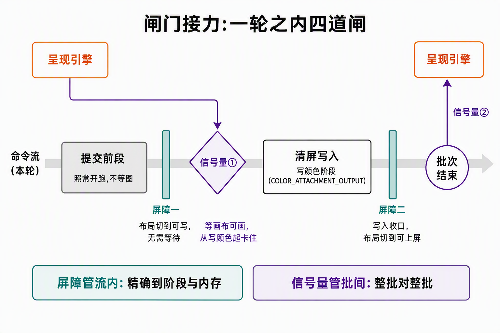

# PipelineStage：屏障与信号量的共同语言

> 2026-09-22,施工④收官后的同步语义篇。《[帧流程：一帧之内各Vulkan对象如何接力.md](帧流程：一帧之内各Vulkan对象如何接力.md)》在**角色层**回答了"谁置位、谁等令";本篇下沉一层,回答"闸门挂在哪、为什么挂在流水线阶段上"——屏障(Barrier)与信号量(Semaphore)不是两套机制,而是同一语法的两档粒度。代码锚点:`ash_renderer/src/frames.rs:120-220`(`record_clear_and_submit`:两道屏障 + 一次提交)、`ash_renderer/src/swapchain.rs:180-222`(`acquire`/`present`)。

## 0. 一句话结论

**同步就是插闸门:左边"谁必须干完",右边"谁才被放行"——而"谁"只能用流水线阶段(PipelineStage)来报名。**

屏障焊在**命令流内部**:两个方向都能精挑,精确到"哪个阶段的哪类内存操作"。信号量焊在**两次队列操作之间**:只留一个旋钮——等令方从哪个阶段开始卡住;发令侧固定是"对面整批全部干完"。读懂一切 Vulkan 同步参数只要两句话:**stage mask 管时间(何时),access mask 管内存(什么数据)**。

## 1. 为什么需要"阶段":命令是段,不是点

**提交保序 ≠ 逐条跑完。**命令缓冲里的命令按序提交,但 GPU 是流水线:第 2 条命令的顶点处理,可以和第 1 条命令的写颜色**同时在不同台站跑**。像排队点菜保序,但后厨洗、切、炒是重叠的。

这就带来一个问题:"清完屏再画三角形"这句话,翻译给 GPU 听时,"清完"没法指——命令是段,没有单一的"完成时刻"。必须精确到台站:不是"清屏命令结束",而是"**清屏在'写颜色'阶段的写入干完**"(srcStage)之后,"**画三角形对这块图的访问才准开工**"(dstStage)。闸门挂在**台站之间**,这是 Vulkan 一切同步参数的语法。

阶段家族速查(三条支线并行存在,图形链按流水顺序排列):

| 支线 | 阶段(按流水顺序) |
|---|---|
| 图形 | 顶点输入 → 顶点着色 →〔曲面/几何〕→ 早期深度测试 → 片段着色 → 后期深度测试 → **写颜色(COLOR_ATTACHMENT_OUTPUT)** |
| 计算 | 计算着色(COMPUTE_SHADER) |
| 搬运 | 复制/清空/解析等 transfer 阶段 |

两端是**虚拟站**:TOP_OF_PIPE(还没进任何台站)、BOTTOM_OF_PIPE(已出所有台站)。关键认知:**阶段名不属于某条命令,是所有命令共享的"流水线上的位置"**——同步双方各报各的位置,闸门才挂得上去。D3D12 同样画流水线,但把阶段藏起来了:ResourceBarrier 只让你报资源的前后状态,冲刷时机由运行时推断;Vulkan 把台站暴露给程序员,换来精确控制,代价是四个掩码自己配。

## 2. 屏障:流内的精细闸门

`cmd_pipeline_barrier` 本身就是**命令流里的一条命令**,像站在流中某点的交通岗,宣布:"从这里起,左边这些台站的这些访问必须先收尾,右边这些台站的这些访问才准开始。"四个掩码两两一组:

| 掩码 | 回答什么 | 属于 |
|---|---|---|
| `src_stage_mask` | 左边谁必须**干完** | 时间(执行依赖) |
| `dst_stage_mask` | 右边谁才能**开工** | 时间(执行依赖) |
| `src_access_mask` | 左边哪类**写**必须落袋(冲出缓存) | 内存(可见性) |
| `dst_access_mask` | 右边哪类**读**要直接看显存 | 内存(可见性) |

**执行依赖 ≠ 内存依赖——这是屏障最容易被吞掉的一课。**"片段着色跑完"只代表计算结束,不代表结果已从 GPU 的写缓存落到显存;下一个读它的命令哪怕在更晚的阶段,也可能读到旧值。所以 stage 组排时间表,access 组立缓存纪律:srcAccess 声明"这几类写要冲刷",dstAccess 声明"这几类读不许走缓存"。**stage 配对了、access 空着,是 Vulkan 最经典的静默翻车**——不报错,画面里就是脏数据。

### 2.1 逐参数拆本项目两道屏障

**进场屏障**(`frames.rs:138-158`,acquire 之后、清屏之前):

| 参数 | 值 | 为什么 |
|---|---|---|
| `old_layout` | UNDEFINED | acquire 拿回的图布局不定;**UNDEFINED 同时宣布"旧内容作废"** |
| `new_layout` | COLOR_ATTACHMENT_OPTIMAL | "作为颜色附件可写"的布局 |
| `src_stage` | TOP_OF_PIPE | 旧内容作废 → 没有"必须等完的写入"。TOP_OF_PIPE 是虚位锚点:不要求前面任何台站干完,只把这条屏障钉在流中位置上 |
| `dst_stage` | COLOR_ATTACHMENT_OUTPUT | 布局切换必须赶在"第一次用新布局"(写颜色)之前生效 |
| access | 全空 | 合法且正确:**方向上没有交接**——没人要读旧内容,无内存需冲刷可见 |

**出场屏障**(`frames.rs:181-203`,清屏之后、提交之前):

| 参数 | 值 | 为什么 |
|---|---|---|
| `old→new` | COLOR_ATTACHMENT_OPTIMAL → PRESENT_SRC_KHR | PRESENT_SRC 是呈现引擎专用布局,不换不让上屏 |
| `src_stage` | COLOR_ATTACHMENT_OUTPUT | 写颜色就发生在这个台站,等它干完 |
| `src_access` | COLOR_ATTACHMENT_WRITE | **必须写**:把颜色写入冲出缓存,呈现引擎才读得到成品——这一行就是"执行依赖不够、内存依赖才收口"的活例 |
| `dst_stage` | BOTTOM_OF_PIPE | 下一个消费者在流水线**外面**(呈现引擎),流内没有台站需要被放行——"右边没人了"就写到管道底 |
| `dst_access` | 空 | 流内没有"读方命令",无处可声明;可见性由信号量批间语义接力(§3) |

对照读:进场全空,因为**没有交接**(作废);出场 src 必写,因为**有交接且收件人在流外**。屏障的宽窄完全由"你在流里隔开什么"决定——它不是一个仪式,是一份精确到字节类别的交接单。

## 3. 信号量:批间的粗粒度闸门

屏障是命令流里的一条命令;信号量根本不进命令缓冲——它挂在**队列操作之间**:acquire 递出(`swapchain.rs:183`)、submit 等待并置位、present 等待(`frames.rs:209-217` / `swapchain.rs:196-222`)。每个操作都是一次批间交接,信号量就是批与批之间的闸门。

等待的语法只有一个旋钮,却是全文的钥匙:**`wait_dst_stage_mask` 和屏障的 `dst_stage_mask` 是同一个东西。**

```
wait_semaphores: [image_available]
wait_dst_stage_mask: [COLOR_ATTACHMENT_OUTPUT]     // frames.rs:208
```

精确含义:**本批提交里,"写颜色"阶段之前的部分(顶点输入、顶点着色等)立即开跑、不必等图;从"写颜色"阶段起卡住,直到呈现引擎置位 image_available。**这不是"整批等图",是"只挡住用图的那一刻"。清屏阶段前面没有顶点工作,这个重叠暂时用不上;step3 画三角形时,顶点处理与等图重叠,省的就是这段时间。反过来,若把 dst 写成 TOP_OF_PIPE,等于宣布"全批冻结等图",并行窗口全部关闭——旋钮拧错,性能直接掉进串行。

信号量的不对称结构也在这里看清:

- **等令侧有旋钮**(从哪个阶段卡住),**发令侧没有**——submit 的 signal_semaphores 固定在**整批全部执行完**才置位;acquire 的信号量由呈现引擎在"图真正可画"时置位。置位语句在代码里搜不到,发令方在驱动里(帧流程篇 §2.1);
- **内存是隐含全量的**:屏障要自己声明"哪类内存",信号量不给这个选项——语义固定为"对面整批的一切写入,对本批 dst 阶段之后的执行全部可见"。粒度粗一档,换来免配 access。所以 present 引擎接图不需要任何补充屏障,WSI 交接自带收口。

还有一条纪律:信号量是**二值一发一收**(置位一次、等令消费一次),没有 CPU 可读的值、不能查询、不能当计数器。每次 acquire 都要一个"干净"的信号量——这正是按帧槽位备两套轮换的原因(帧流程篇 §4)。

## 4. 三种闸门一张表

| 闸门 | 焊在哪 | 左边(等谁) | 右边(放行谁) | 内存语义 |
|---|---|---|---|---|
| 屏障 | 命令流内部(命令缓冲里的一条命令) | 可选:阶段 × 访问 | 可选:阶段 × 访问 | 自己声明,可精可空 |
| 信号量 | 队列操作之间(acquire/submit/present 的参数) | 固定:对面整批全部执行完 | 可选:从哪个阶段起卡 | 隐含全量,免配 |
| 栅栏 | 提交与 CPU 之间 | 固定:整批全部执行完 | CPU 的 `wait_for_fences` | 隐含全量,**唯一可达 CPU** |

屏障与信号量不是二选一,是**接力**:同一轮提交里,流内的布局与缓存纪律交给屏障,批间的等图与交图交给信号量。判定线一句话:**闸门双方都在同一条命令流里 → 屏障;隔着队列操作 → 信号量;等令方是 CPU → 栅栏。**



*读图:顶部条带是流水线外的呈现引擎;中间横轴是本轮提交的命令流,时间从左向右。紫色闸门是信号量(批间):左边一道挡在"写颜色"之前——前面阶段照常开跑、不必等图,右边一道在批次结束时置位"画完"交回呈现引擎。蓝绿闸门是屏障(流内):进场一道把布局切到"可写"(旧内容作废、无需等待),出场一道把写入冲出缓存并把布局切到"可上屏"。底部结论条是本文主旨:屏障精确到阶段×内存,信号量整批对整批。*

## 5. FAQ 与坑

- **只配 stage 不配 access,为什么会翻车?**执行依赖只保证"计算跑完了",不保证"结果离开了缓存"。写停在写缓存里、后一个命令从显存读到旧值,全程无报错。判据:src 侧有任何要给别人看的写,srcAccess 就得报名;dst 侧有读,dstAccess 就得报名。本项目唯一 access 全空的进场屏障,合法性来自 UNDEFINED 作废旧内容——**没有交接,才允许空单**。
- **TOP_OF_PIPE / BOTTOM_OF_PIPE 是万能锚点吗?**它们是虚位站:TOP 当 src ≈ "前面没有必须等完的"(适合作废旧内容);BOTTOM 当 dst ≈ "右边没有流内的人"。真想"一网打尽"该用 ALL_COMMANDS(两侧全选),更安全也更粗。本项目沿用 vulkan-tutorial 血统的写法,读得懂即可;step3 接管线后,掩码会随具体读写变得具体,sync validation 层也会开始盯配错。
- **屏障能跨队列吗?**不能,它只对同一条队列的命令流生效。跨队列交接只能信号量;交回 CPU 只能栅栏。
- **等在写颜色阶段,是不是白等了一段?**恰相反,这是**最精确的一点**:图只在"写颜色"被用到——等得更早,是把本可重叠的阶段白白冻住;等得更晚,写的时候图还没到手。清屏时这个重叠窗是空的,机制为 step3 留着。
- **为什么不用栅栏代替信号量?**等令方身份不同:栅栏只有 CPU 能等(有状态可查),GPU 时间线上无法用栅栏给两批工作排序;信号量相反。Vulkan 干脆拆成两种对象;D3D12 是同一个 fence 对象两处用。

## 6. Unity / D3D 映射

| 本项目 | D3D12 / Unity 对应物 | 差异要点 |
|---|---|---|
| PipelineStage | 无对应暴露 | D3D12 藏起阶段,冲刷由运行时按资源状态推断;Unity 全托管 |
| ImageMemoryBarrier(布局+阶段+访问) | ResourceBarrier(状态转移) | D3D12 一维"前后状态";Vulkan 拆成三个维度,细但啰嗦 |
| 信号量(批间) | 跨队列 fence(queue.Signal / queue.Wait) | D3D12 同一 fence 兼管 CPU/GPU 两种等待;Vulkan 按等令方拆两种对象 |
| `wait_dst_stage_mask` | 无(DXGI/运行时打包) | "等图只卡用图阶段"这层控制在 D3D 里看不见 |
| 进场/出场两道布局屏障 | COMMON ↔ RENDER_TARGET ↔ PRESENT 转移 | 思想同源;D3D12 的状态机替你算了访问掩码 |

## 7. step3 生长点

同步骨架(两帧在飞 + 双信号量 + fence)不动,生长在掩码与队列上:上传顶点/纹理会引入**搬运阶段 → 图形阶段**的屏障(srcStage=TRANSFER → dstStage=VERTEX_INPUT / 片段采样);transfer 队列分家时跨队列交接走信号量、图像所有权转移靠屏障的 queue family 索引(EXCLUSIVE 模式暂用不上);多队列排班可换**timeline semaphore**(带数值、CPU 可查,等于信号量与栅栏合体)。判定线不变:闸门双方在哪,决定用哪种闸门。

## 8. 自测三问(能答出才算过)

1. 屏障的四个掩码,哪两个管时间、哪两个管内存?只配时间会出什么事故?
2. `wait_dst_stage_mask = COLOR_ATTACHMENT_OUTPUT` 时,提交批次里哪些部分还在跑、哪些卡住了?改成 TOP_OF_PIPE 损失什么?
3. 同一条命令缓冲里两段工作要排序,用信号量行不行?反过来,acquire 到 present 之间能用屏障代替信号量吗?
